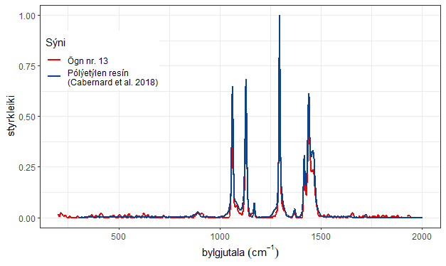
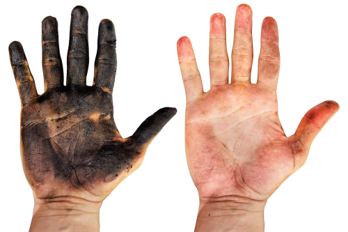
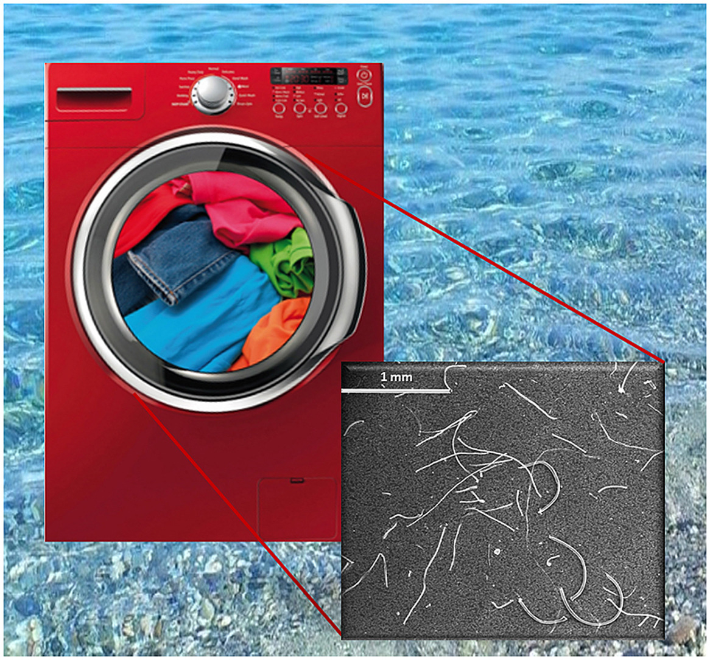
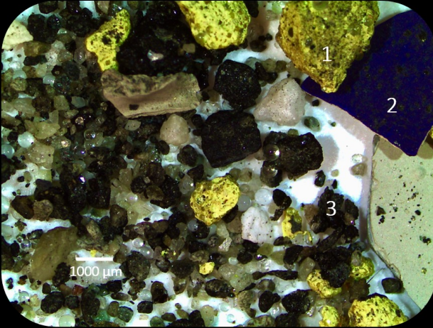

class: center, top
background-image: url("https://thumbs.gfycat.com/PersonalInfantileCuckoo-size_restricted.gif")
background-size: 100%
.content.vmiddle[
.center[
# .white[Örplast]
## .white[í náttúru Íslands]

## 


]]

.bottom_abs[.footer-note[.tiny[.green[Image Credit: ][tactical_hog](https://gfycat.com/personalinfantilecuckoo)]]
]

???
<!-- background-image: url("https://thumbs.gfycat.com/PersonalInfantileCuckoo-size_restricted.gif") -->
Hæ, my name is
This is a talk about the main sources of MP's in Iceland and their pathways to the ocean. It's taken from a report that the companies/institutions I work for did for the environmental ministry of Iceland.

---

layout: false
class: split-two 

.column.bg-main1[
.split-two[

.row.bg-white[.content.vmiddle[
.center[
.nopadding[
 
 ### NNV í samstarfi við BioPol
 ## Örplastrannsóknir:
 ### Sýnatökur, .blue[sanngreining],
 ### greinaskrif og skýrslur.
]]]]

.row.bg-main1[
.content.vmiddle[.center[
.nopadding[
.img-fill[]
]]]]
]]

.column.bg-main1[
.split-two[

.row.bg-main1[.content.vmiddle[
.center[
.nopadding[
.img-fill[]
]]]]

.row.bg-main1[.content.vmiddle[
.center[
.nopadding[
.img-fill[]
]]]]

```{r plot, eval=FALSE, message=FALSE, warning=FALSE, include=FALSE, out.width='100%'}
library(tidyverse)
presin <- read.csv("skjol/Polyethylene_resin_Cabernard_et_al_2018.csv")
ogn <- read.csv("skjol/Ogn_nr_13.csv")
ogn$Sýni <- 'Ögn nr. 13'
presin$Sýni <- 'Pólýetýlen resín \n(Cabernard et al. 2018)'

litir <- c('#f60000','#09428f')

p <- rbind(presin[,c(2,3,6)],ogn[ogn$wavenumber<2000,]) %>% 
  ggplot(aes(x=wavenumber, y=intensity, colour = Sýni)) +
  geom_line(size=1) +
  labs(x = bquote('bylgjutala'~(cm^-1)), y = "styrkleiki")+
  scale_color_manual(values = litir)+
  theme_bw()+
  theme(strip.text.x = element_blank(),
      strip.background = element_rect(colour="white", fill="white"),
      legend.position=c(.15,.75)
      )

```
]]]]]


???
Backstroy:
A quick backstory on how this project came to me or us. Well, Biopol had done environmental sampling of plankton (both phytoplankton and zooplankton) for several years and these particles and threads had always been there in the samples and we would think none of it until one of us heard about MP's in 2011 and started counting the particles. Then later we noticed that fibers from our sampling gear and our clothes were detectable in our samples so we upgraded our methods to meet the relevant standards of MP sampling and also the purification of the samples and today, we go through the whole process, from sampling to analyzing spectral data.

---

layout: true
class: split-30 with-no-border

.column.bg-red[.content.center.vmiddle[
.yellow.font-perm.font2[HVAÐAN KEMUR ÖRPLAST Á íSLANDI?]
<br>
<br>
.img-fill[]
.bottom_abs[.footer-note[.tiny[.green[Image Credit: ][CJ_Productions](https://www.reddit.com/r/cutouts/comments/3u9prd/travolta_cutout_technically_gif_format_optimized/)]]
]
]]


.column.bg-white[.content.center.vmiddle[

.img-fill[]


]]


???
Well were does mp pollution in Icelandic seas come from?
We began to look into the literature for Pathways and sources to see where microplastics might be coming from and how they reach the ocean. 
There are many different sources of MP's that are important depending on the pathway they travel to the ocean.
We can't separate the sources from the pathways since it had to reach the ocean by some means

---
class: show-100


---
count: false
class: show-110


---

layout: false
class: split-33

.column.bg-main2[.content.vmiddle[
.center[
# Helstu uppsprettur örplasts á Íslandi
<br>
<br>
.font-mono[Lægri vikmörk/mat]
<br>
.font-mono[Tonn á ári]
]]]

.column.hide-slide-number[.content.vmiddle.center[

```{r SankBig, echo=FALSE, message=FALSE, warning=FALSE, out.height='55%', out.width='90%'}
#losun <- (l+h)/2 #Meðaltal lægra og hærra mats á losun.
slit=c(371, 41, 26, 33.2, 60, 3, 0.2, 8.2, 0.34, 1, 0.002)
losun= c(164, 5.7,  0, 15.2, 3.2, 0.3, 0, 8.2, 0.34, 0, 0.002)
land=slit-losun
library(networkD3)
A <-  c("Hjólbarðar ","Vegamálning ","Hjólbarðar flugvéla ","Húsamálning ","Skipamálning ","Gervigras ","leikvellir ","Þvottur ","Snyrtivörur ","Högl ","Sigvatn úr landfyllingum ","Land ","Haf ")
nodes <- as.data.frame(A)
names(nodes) <- "name"
#nodes$name <-  as.character(nodes$name)
links <- data.frame(source=rep(0:10,2),target=rep(11:12, each=11),value=c(land,losun))
Sank <- list(nodes, links)
names(Sank) <- c('nodes', 'links')
sn <- sankeyNetwork(
  Links = Sank$links,
  Nodes = Sank$nodes,
  Source = "source",
  Target = "target",
  Value = "value",
  NodeID = "name",
  units = "tonn",
  colourScale = JS("d3.scaleOrdinal(d3.schemeCategory20);"),
  fontSize = 28,
  nodeWidth = 30, width = "681px", height = "678", fontFamily = "Courier"
)
#sn
library(widgetframe)
rammi <- frameWidget(sn)
rammi
```

]]

???
These are the estimates most important sources of MP's accdording to our study.
(Move the bars around)
We divide them with respect to their fate or where they end up eventually, if they fall into soil or landfill for example or if they're delivered straight to the ocean.
You can see, for example, how the shedding of MP particles from laundry goes almost exclusively to the ocean via sewage while the majority of the much greater source, car tires, end up mostly in soil on land.
Confidence intervals are not presented in this visualization and these are the lower estimates of a large error margin.

---


layout: true
class: split-two with-border border-white

.column.bg-main3[.content[
  .split-five[
 .row.bg-main1[.content[
### Örplast frá snyrtivörum er aðallega vegna handsápu af verkstæðum.

 ]]
  .row.bg-main2[.content[
### Gera þarf markaðsrannsókn til að meta betur plastinnihald í mismunandi húsamálningu og hlutfall málningar sem seld er til atvinnumálara og heimila.
 ]]
  .row.bg-main4[.content[
### Þegar skip eru í slipp er hætta á að málningarflyksur berist í sjó. Gera mætti athugun á starfsháttum stóru slippanna.
 ]]
  .row.bg-main2[.content[
### Tölur um losun frá þvotti á fatnaði úr gerviefnum eru komnar til ára sinna og því nauðsynlegt að uppfæra þær.
 ]]
   .row.bg-main1[.content[
### Dekkjakurl og vegmerkingar eru einna mest rannsakaða viðfangsefnið erlendis og yfirfærist ágætlega á Íslenskar aðstæður.
 ]]
 ]
]]

.column.bg-white[.content.center.vmiddle[
{{content}}
]]

???
Define the layout and for sequence hide the appropriate cell.

---

class: hide-row2-col1 hide-row3-col1 hide-row4-col1 hide-row5-col1 with-thick-border border-white

```{r homer, echo=FALSE, message=FALSE, warning=FALSE,out.width = '50%'}
mynd <- 
mynd
```

???

Stærsta uppspretta örplasts í umhverfinu á Íslandi, sem lagt var mat á, er tengd bifreiðaumferð. Slit á dekkjum og vegmerkingum er um 60-85% örplastslosunar á Íslandi. 

---

class: fade-row1-col1 hide-row3-col1 hide-row4-col1 hide-row5-col1 with-thick-border border-white
count: false

```{r malun, echo=FALSE, message=FALSE, warning=FALSE, cache=FALSE,out.width = '50%'}
mynd <- knitr::include_graphics("images/thok.png")
mynd
```

---

class: fade-row1-col1 fade-row2-col1 hide-row4-col1 hide-row5-col1 with-thick-border border-white
count: false

```{r slippur, echo=FALSE, message=FALSE, warning=FALSE, fig.show='hold',out.width = '50%', dev.args=list(bg="transparent"),fig.cap='Samband skipslengdar og botnflatar. Kökuritið sýnir hlutfall botnflatar íslenskra fiskiskipa í þremur stærðarflokkum', fig.align='center' }
par(mar = c(4.6, 6, 0, 0))
Batar <- read.csv("skjol/batar.csv",fileEncoding = "UTF-8")
litlir <- Batar[Batar$Lengd<15,]
storir <- Batar[Batar$Lengd>30,]
adrir <- Batar[!rownames(Batar) %in% c(rownames(litlir),rownames(storir)),]
Batar$gerd <- ifelse(Batar$Lengd<15, "Smábátar",ifelse(Batar$Lengd>15 & Batar$Lengd<30,"Miðlungs","Stór skip"))

litura="#cb5600"
liturb="#28c1ff"

yLab=expression(paste("Botnflötur ( ",m^2,")"))
xLab="Lengd (m)"
plot(Batar$Lengd,(Batar$WSA),type='n', ylab = "",xlab="")
mtext(xLab,1,3,cex=2)
mtext(yLab,2,3,cex=2)
points(litlir$Lengd,(litlir$WSA),col=liturb, pch=18)
points(adrir$Lengd,(adrir$WSA),col=1)
points(storir$Lengd,(storir$WSA),col=litura, pch=19)
legend("topleft",c("Smábátar <15m. N=972","Miðlungs N=75","Stór skip >30m. N=99"),col = c(liturb,1,litura),pch = c(18,1,19),cex=2,bty='n')

# landi <- data.frame(
#   skr=c(2890,2889,2895,1868,2170,1902,2881,2882,2184),
#   L = c(54.75,54.75,54.75,56.86,64.55,55.6,80,81,66.96),
#   Breidd = c(13.5, 13.5, 13.5, 12.6, 12.8, 12.8, 17, 17, 13),
#   Brt= c(1827,1827,1827,1469.7,1845,1521,3672,3672,2160),
#   D = c(4.7, 4.7, 4.7, 7.7, 8, 8, 8.5, 8.5, 8.53)
# )
# 
# landi2 <- Batar[Batar$Skipaskrárnúmer %in% landi$skr,]
# points(landi2$Lengd,landi2$WSA,pch=13,cex=2,col=2) #Skip HBGranda

par(mar = c(0, 0, 0, 0))
require(plyr)
kaka <- ddply(Batar,.(gerd),summarise,Flatarmal=sum(WSA))
pie(kaka$Flatarmal,labels = kaka$gerd, border="grey",col = c("transparent",liturb,litura),cex=2,radius = 0.6)
```

---
class: fade-row1-col1 fade-row2-col1 fade-row3-col1 hide-row5-col1 with-thick-border border-white
count: false

```{r gervigras, echo=FALSE, message=FALSE, warning=FALSE,out.width = '50%'}
mynd <- 
mynd
```

---
class: fade-row1-col1 fade-row2-col1 fade-row3-col1 fade-row4-col1 with-thick-border border-white
count: false


```{r vegmerkingar, echo=FALSE, message=FALSE, warning=FALSE, cache=FALSE,out.width = '50%'}
mynd <- 
mynd
```


---


layout:false
class: bg-white

background-image: url("images/trafficDensity_BGB.png")
background-size: cover

???
Is there any thing special about the pathways in Iceland? 
---
layout:false
background-image: url("images/trafficDensity_BG.png")
background-size: cover

???
We are in a very sparsely populated country (two thirds of the population live near Reykjavík) and we do not treat our sewage with the aim of reducing mp's. 
The most important pathways in Iceland, one might say, are therefore the sewage system and road run-off in Reykjavík.

---

layout:false
class: split-75 bg-white with-border


.row[
  .split-two.with-border[
  .column.bg-main1[.content[
  <br>
  .bottom_abs[.footer-note[.tiny[[Environment agency](https://tinyurl.com/y6b6x49y)]]]
  <br>


  ]]
  .column[.content.center.vmiddle[
Types of sewage treatment


  ]]
]]
.row[
# Langmest skólp rennur í sjóinn út frá Reykjavík
# .blue[Örplast] er ekki .blue[ennþá] síað út 
]

???
Here the sewage pipes of Rvk can be seen. Sewage is transported fram from shore where it is mixed in with the ocean. On the graph the different types of sewage treatments are color coded. A tall blue column can be seen that represents a sigle-step system that serves the Reykjavík area. No system at all is the most common one in all other parts of the country.


---


layout:false
class: split-50 hide-slide-number
background-image: url("images/straumar.png")
background-size: cover


.font-dance[.font5[Vindar og sjávarstraumar]]


???
That's Eiríkur
 - Local fisherman in my village
 - He's painting the upper part of his boat (the boat must be hauled on land to paint the hull)
 - Eiríkur goes fishing all year round and paints the boat every year

---


layout:false
class: bg-white

background-image: url("images/assorgass.jpg")
background-size: cover


---

layout:false
class: split-40 bg-white with-border

.row[.center[

].top_abs[.tiny[[ALTA](https://www.alta.is/)]]]
.row[
  .split-three.with-border[
  .column.bg-main1[.content[
  <br>
  <br>

    ]]
  .column.bg-white[.content.font2[

 Gróflega áætlað:
* **Í dreifbýli**: .blue[90%] dekkjaagna fer í .blue[jarðveg] en .red[10%] berst með .red[ofanvatni]
* **Í þéttbýli**:.blue[40%] fer í .blue[jarðveg] en .red[60%] berst í .red[fráveitukerfi].
  ]
  .bottom_abs.left[.tiny[(Klein 2017)]]
  ]
  .column.bg-main4[.content[
  <br>
  <br>
  
  ]]
]]

???

There haven't been many extansive studys on pathways of MPs, mainly because of difficulties with sampling, and certainly non such studys in Iceland. So to estimate how much of the sources that don't go directly to the sea, reach the ocean, we used this rough devition between rural and urban. So lets say... if yearly traffic in two roads is them same number of cars but one road lies in the country side while the other runs through the city... the one that runs through the city contributes more mp emissions to the ocean because of the non-porous asphalt and sewers.
---


layout: false
class: split-75 bg-main1 

.row[
# Takk fyrir áheyrnina!
.font2[
*  .yellow[Skýrsluna] má finna [hér](https://harkanatta.github.io/orplastskyrslaUAR/)
* [Hlekkur á Github vinnusvæði hér](https://github.com/harkanatta/orplastskyrslaUAR) 

* Fyrirlesturinn var gerður með R-pakkanum [Xaringan](https://github.com/yihui/xaringan) eftir [sniðmáti](https://emitanaka.org/ninja-theme/themes/kunoichi/kunoichi-theme-example.html) frá Emi Tanaka
* Skýrslan var gerð fyrir [umhverfisráðuneytið](https://www.government.is/ministries/ministry-for-the-environment-and-natural-resources/)
] 
]
.row.split-three[
.column[.content[

]]
.column[.content[
 
]]
.column[.content[
 
]]

]

