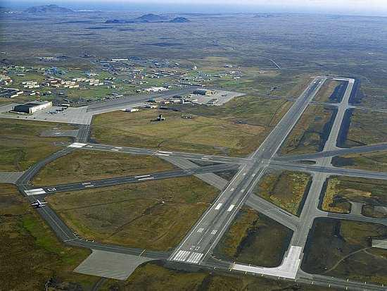
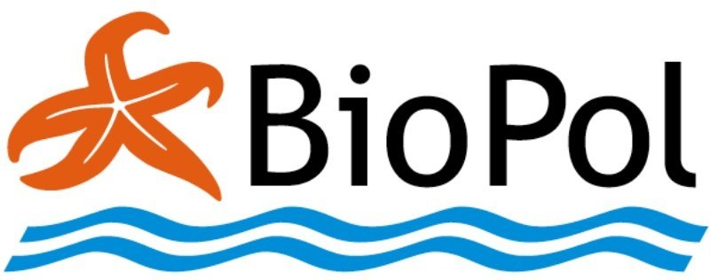

class: center, top
background-image: url("images/blandabru.jpg")
background-size: 100%
.content.vmiddle[
.center[
# .yellow[Main Sources and Pathways of Microplastics]
## .yellow[in Icelandic Oceans]
### .white[Made for the Environmental Ministry of Iceland] 

##  


]]

.bottom_abs[.footer-note[.tiny[.green[Image Credit: ][tactical_hog](https://gfycat.com/personalinfantilecuckoo)]]
]

???
<!-- background-image: url("https://thumbs.gfycat.com/PersonalInfantileCuckoo-size_restricted.gif") -->
---
layout: false
class: split-two with-thick-border border-cyan
.column.bg-main1[
.split-two[
.row.bg-main1[.content.vmiddle[
.center[
.nopadding[
.img-fill[]
]]]]
.row.bg-main1[

.content.vmiddle[.center[
.nopadding[
.img-fill[]
]]]]]]

.column.bg-main1[
  .split-two[
.row.bg-main1[.content.vmiddle[
.center[
.nopadding[
```{r dori, echo=FALSE, message=FALSE, warning=FALSE, cache=FALSE,out.width = '100%'}
mynd <- 
mynd
```
]]]]
.row.bg-main1[

.content.vmiddle[
.center[
 ##  and  Microplastic research:
 ## .orange[Sampling `r icon::octicons$beaker`] and .yellow[Analyzing `r icon::octicons$graph`]
 ## Desktop studies and Reports `r icon::octicons$device_desktop`

]]]]]


???
Why us?/How this project came to me
Takið eftir kaðlinum


---

layout: true
class: split-three with-thick-border

.column.bg-red[.content.center.vmiddle[
.yellow.font-pulp.font2[WHERE DO MICROPLASTICS COME FROM?]
<br>
.img-fill[]
.bottom_abs[.footer-note[.tiny[.green[Image Credit: ][CJ_Productions](https://www.reddit.com/r/cutouts/comments/3u9prd/travolta_cutout_technically_gif_format_optimized/)]]
]
]]


.column.bg-main1[.content.center.vmiddle[
# Many Sources
```{r fjara, echo=FALSE, message=FALSE, warning=FALSE, cache=FALSE,out.width = '100%'}
myndb <- 
myndb
```
]]


.column.bg-main2[.content.center.vmiddle[
# Few Main Pathways
```{r source, echo=FALSE, message=FALSE, warning=FALSE, cache=FALSE,out.width = '100%'}
myndb <- knitr::include_graphics("images/ellidaar_saevarhofdi_02.jpg")
myndb
```
.bottom_abs[.footer-note[.tiny[.green[Image Credit: ][Rvk](https://reykjavik.is/frettir/abyrgd-synd-vid-bilathvott-og-medferd-efna)]]
]
]]


???
We began to look into the literature for Pathways and sources to see where microplastics might be coming from and how they reach the ocean. 
There are many different sources of MP's that are important depending on the pathway they travel to the ocean

---
class: show-100

???
Þetta er sýni úr sjávarseti og þarna má sjá þræði úr fatnaði eða veiðarfærum og fleiri plastagnir sem hafa verið teknar frá öllu hinu gumsinu í sýninu.
---
class: show-110

???
Örplast er jafn fjölbreytt og plast er almennt og það er flest hannað til þess að endast
---
count: false

???
Erfitt að sjá og vandasamt að rannsaka. Við hjá Biopol fengum að kynnast því :)
Við höfum ekki ennþá sammælst um standard aðferðir við að greina örplast


---

layout: false
class: split-33

.column.bg-main4[
.content.vmiddle.right[
.black[
# Main Sources of MP's
categories
]
 .font-soon[
 .red[Tirewear Particles]<br>
 .black[Road Paint]<br>
 .red[House Paint]<br>
 .black[Artificial Turf and Playgrounds]<br>
 .red[Laundry]<br>
 .black[Cosmetics]<br>
 .red[Fishing Gear]<br>
 .black[Plastic Waste on the Coastline]
]]]
.column.content.center[
```{r echo=FALSE, message=FALSE, warning=FALSE, out.width="85%"}
knitr::include_graphics("images/samansetning.png")
```

]


???
Fishing gear needs closer attention
Veiðarfæri þarf að rannsaka betur. Sum veiðarfæri trosna við notkun og losnar nælon ofl. örplast þannig beint í hafið. Þetta er ekki flókinn iðnaður þá að hann sé stórtækur og því ætti að vera hægt að fylgjast betur með því hve mikið af veiðarfærum er í umferð
Fjörurnar eru eins og verksmiðjur sem mala örplast úr stærra plastrusli

Samsett mynd:
https://www.abc.net.au/news/2019-09-26/delicate-washing-cycle-releases-microplastics/11551356
...ofl.

---

layout: false
class: split-33

.column.bg-main2[.content.vmiddle[
.center[
# Estimates of the Main Sources of Microplastics
<br>
<br>
.font-mono[Tonnes per year]
]]]

.column[.content.vmiddle.center[

```{r SankBig, echo=FALSE, message=FALSE, warning=FALSE, out.width='100%', fig.cap="Microplastic release on land and in the ocean"}
#losun <- (l+h)/2 #Meðaltal lægra og hærra mats á losun.
slit=c(371, 41, 26, 33.2, 60, 3, 0.2, 8.2, 0.34, 1, 0.002)
losun= c(164, 5.7,  0, 15.2, 3.2, 0.3, 0, 8.2, 0.34, 0, 0.002)
land=slit-losun
library(networkD3)
A <-  c("Car tires ","Road paint ","Airplane tires ","House paint ","Ship paint ","Artificial turf ","Playgrounds ","Laundry ","Cosmetics ","Hail shots ","Landfill leachates ","Land ","Ocean ")
nodes <- as.data.frame(A)
names(nodes) <- "name"
#nodes$name <-  as.character(nodes$name)
links <- data.frame(source=rep(0:10,2),target=rep(11:12, each=11),value=c(land,losun))
Sank <- list(nodes, links)
names(Sank) <- c('nodes', 'links')
sn <- sankeyNetwork(
  Links = Sank$links,
  Nodes = Sank$nodes,
  Source = "source",
  Target = "target",
  Value = "value",
  NodeID = "name",
  units = "tonn",
  colourScale = JS("d3.scaleOrdinal(d3.schemeCategory20);"),
  fontSize = 28,
  nodeWidth = 30, width = "681px", height = "678", fontFamily = "Courier"
)
#sn
library(widgetframe)
rammi <- frameWidget(sn)
rammi
```

]]

???
fig.cap='Helstu uppsprettur örplasts á Íslandi og skipting þess eftir farleiðum í haf eða í jarðveg. Byggt á lægra mati.',
Dekkjakurl berst til hafs í gegnum ræsi í þéttbýli en festist að mestu í jarðveginum við vegina. Stærsta uppspretta örplasts í umhverfinu á Íslandi, sem lagt var mat á, er tengd bifreiðaumferð. Slit á dekkjum og vegmerkingum er um 60-85% örplastslosunar á Íslandi.
Vegmerkingar berast með sömu leiðum til hafs
Útimálning berst einnig með affallsvatni gegnum ræsi en innimálningu er gjarnan hellt beint í niðurföll og berst þaðan í sjóinn
Gervigras "mælt með því að á keppnisvöllum sé árlega bætt við 3-5 tonnum af fylliefni"


---
layout:false
class: split-30 hide-slide-number
background-image: url("images/blandabru.jpg")
background-size: cover

.column.slide-in-left[
.sliderbox.shade_main.center[
.font5[Transport]]]
.column[
]

.bottom_abs[.footer-note[.tiny[.green[Image Credit: ][Róbert Daníel Jónsson ](https://www.flickr.com/photos/robbidan/)]]
]
---
layout: true
class: split-two

.column.bg-main3[.content[
  .split-three[
 
 .row.bg-main1[.content.left.font_medium.vmiddle.center[
* .blue[The soles] of tires are made of a synthetic rubber blend which is released in traffic.
* .blue[Tirewear and road particles] along with .blue[road paint] are well studied emission sources and can be applied to Icelandic conditions.
* These particles range mostly from .blue[10-100 µm] (bigger than aerosol)
 ]]
 
  .row.bg-main2[.content.left.font_medium[
* .blue[Numbers] of vehicles, types and weight (Icelandic transport authority)
* Estimates of .blue[wear] of tyres (Klein 2017)
* Estimates of .blue[emissions] (Vershoor 2016)

 ]]
 
  .row.bg-main4[.content.left.font_medium[
* On rural roads: .blue[90%] of road runoff goes to the .blue[soil] and .red[10%] to .red[surface water]
* In urban areas:.blue[40%] to .blue[soil] and .red[60%] to the .red[sewers].
* Great concentration of traffic in Reykjavík


 ].bottom_abs[.footer-note[.tiny[(Klein 2017)]]]]
 
]]]


.column.bg-white[.content.center.vmiddle[
{{content}}
]]


???
Define the layout and for sequence hide the appropriate cell.
https://tinoxchem.com/wp-content/uploads/2019/10/roadmarking.jpg
---

class: hide-row2-col1 hide-row3-col1 with-thick-border border-white

# Car tyres

```{r vegmerkingar1, echo=FALSE, message=FALSE, warning=FALSE, cache=FALSE,out.width = '60%',fig.show='hold'}
 knitr::include_graphics(c("images/tyre.jpg","images/Kreider_et_al_2010.png"))
```

???

Stærsta uppspretta örplasts í umhverfinu á Íslandi, sem lagt var mat á, er tengd bifreiðaumferð. Slit á dekkjum og vegmerkingum er um 60-85% örplastslosunar á Íslandi. 

---

class: fade-row1-col1 hide-row3-col1 with-thick-border border-white

```{r SankSmall,  echo=FALSE, message=FALSE, warning=FALSE, out.width='100%', fig.cap="Microplastic release on land and in the ocean"}
slit=c(244,34,22,79) 
losun=c(106,15,9,34)
land=slit-losun
library(networkD3)
A <- c("Small Vehicles ","Delivery Vans ","Buses ","Lorrys ","Land ","Ocean ")
nodes <- as.data.frame(A)
names(nodes) <- "name"
#nodes$name <-  as.character(nodes$name)
links <- data.frame(source=rep(0:3,2),target=rep(4:5, each=4),value=c(land,losun))
Sank <- list(nodes, links)
names(Sank) <- c('nodes', 'links')
sn <- sankeyNetwork(
  Links = Sank$links,
  Nodes = Sank$nodes,
  Source = "source",
  Target = "target",
  Value = "value",
  NodeID = "name",
  units = "tonn",
  colourScale = JS("d3.scaleOrdinal(d3.schemeCategory20);"),
  fontSize = 28,
  nodeWidth = 30, width = "500px", height = "400px", fontFamily = "Courier"
)

library(widgetframe)
rammi <- frameWidget(sn)
rammi
```

```{r akstur, echo=FALSE, cache = TRUE}
library(RColorBrewer)
options(OutDec = ",")
# Heildarþyngd ökutækis: Þyngd ökutækis eða vagnlestar með ökumanni, farþegum, farmi og viðfestum vinnutækjum.


bifreidar <- matrix(c(227409,23159,2410,8078,2049,2661,9746,17181,12601,14251.6,33693.6,17832,85,102,267,546,132,159,415,850),5,4,byrow = T)

slit_lagt <- bifreidar[1,]*bifreidar[3,]*bifreidar[4,]/1000000000 #Fjöldi*meðalakstur*(slit (mg/ári) lægri talan)
losun_lagt <- c()
  for (i in 1:length(slit_lagt)) {
  losun_lagt[i] <- (2/3)*slit_lagt[i]*0.6+(1/3)*slit_lagt[i]*0 #Verschoor2016
}
slit_lagt <- round(slit_lagt,0)
losun_lagt <- round(losun_lagt,0)

slit_hatt <- bifreidar[1,]*bifreidar[3,]*bifreidar[5,]/1000000000 #Fjöldi*meðalakstur*(slit (mg/ári) hærri talan)
losun_hatt <- c()
for (i in 1:length(slit_hatt)) {
  losun_hatt[i] <- (2/3)*slit_hatt[i]*0.6+(1/3)*slit_hatt[i]*0 #Verschoor2016
}
slit_hatt <- round(slit_hatt,0)
losun_hatt <- round(losun_hatt,0)

slit_ari <- ifelse(slit_hatt>slit_lagt,paste(slit_lagt,slit_hatt,sep = "-"),paste(slit_hatt,slit_lagt,sep = "-"))
losun_ari <- ifelse(losun_hatt>losun_lagt,paste(losun_lagt,losun_hatt,sep = "-"),paste(losun_hatt,losun_lagt,sep = "-"))

bifreidar[2,] <- round(bifreidar[2,]/1000,2)
bifreidar[3,] <- round(bifreidar[3,]/1000,2)
bifreidar <- rbind(bifreidar[1:3,],paste(bifreidar[4,],bifreidar[5,],sep="-"),slit_ari,losun_ari)

colnames(bifreidar) <- c("Small Vehicles","Delivery Vans","Buses","Lorrys")
rownames(bifreidar)<- c("Number","Mean weight (t)","Average usage (K km/year)","Wear & tear (mg/km)", "Wear & tear (t/year)", "Release to ocean (t/year)")


#bifreidar <- rbind(icon[c(1,2,3,4)],bifreidar)
bifreidar <- format(bifreidar,  decimal.mark=",", big.mark=".", scientific=FALSE)

if (knitr::is_html_output()) {
   knitr::kable(bifreidar, booktabs=T, caption = ".")

} else {
  rownames(bifreidar)<- c("Fjöldi","Meðalþyngd (t)","Meðalakstur (þús. km/ár)","Slit (mg/km)", "Slit (t/ár)", "Losun í hafið (t/ár)")
 knitr::kable(bifreidar, caption = "Áætluð árleg losun örplasts í hafið vegna slits á hjólbörðum bifreiða. Fjöldi bíla af mismunandi gerðum í umferð á Íslandi þann 14. ágúst 2018 og meðalakstur skv. Umferðastofu. Með meðalþyngd er átt við heildarþyngd skv. reglugerð. Byggt á mati Klein (2017) og Verschoor (2016)",format = 'latex', booktabs=T)
   }
options(OutDec = ".")

```


???
Klein J, Geilenkirchen G, Hulskotte J, Ligterink N, Molnár-in’t Veld H. Methods for calculating the emissions of transport in the Netherlands. The report, including the tables in the Excelfile, can be found on: http://www cbs nl. 2017. https://www.pbl.nl/en/publications/methods-for-calculating-transport-emissions-in-the-netherlands-2017.

Verschoor A, Poorter L de, Dröge R, Kuenen J, Valk E de. Emission of microplastics and potential mitigation measures. 2016:76. https://www.rijksoverheid.nl/binaries/rijksoverheid/documenten/rapporten/2016/07/11/emission-of-microplastics-and-potential-mitigation-measures/emission-of-microplastics-and-potential-mitigation-measures.pdf.

---

class: fade-row1-col1 fade-row2-col1 with-thick-border border-white

# Highly concentrated population and traffic

```{r trafficdens, echo=FALSE, message=FALSE, warning=FALSE, out.width = '100%', dev.args=list(bg="transparent"), fig.align='center' }
mynd <- knitr::include_graphics('images/trafficDensity_BG.png')
mynd
```

---

layout: true
class: split-two with-border border-white

.column.bg-main3[.content[
.split-three[

  .row.bg-main2[.content.font_medium[
* .blue[The Icelandic road (and coastal) administration] .white[IRCA] oversees the majority of the roadsystem and supplied available statistics based on their inventory of imported road paint.
* Polymer ingredient uncertain - .red[large margin of error]

 ]]
   
   .row.bg-main1[.content.font_medium[
* Much of the road paint is on .red[rural] roads and goes therefore mostly into .red[soil] (Klein 2017)
.bottom_abs[.footer-note[.tiny[.green[Image Credit: ][Alta](https://www.alta.is/)]]
]]]

   .row.bg-main1[.content.font_medium[
* Up to ½ Kg loss per take off/landing (Kole 2017)
* One international airport in Iceland
* Run-off water drained in soil around the airport 
.bottom_abs[.footer-note[.tiny[.green[Image Credit: ][Mats Wibe Lund](https://mats.photoshelter.com/index)]]
]]]

]
 ]]
 

.column.bg-white[.content.center.vmiddle[
{{content}}
]]

---

class: hide-row2-col1 hide-row3-col1 with-thick-border border-white


```{r vegmerkingSank,  echo=FALSE, message=FALSE, warning=FALSE, out.width='100%', fig.cap=" ", cache=T}
nodes <- c('Larger mun. ','Smaller mun. ','IRCA ','Thermopl. ','Paint ','Source low est. ','Source high est. ','Ocean','Ocean','Land','Land')
nodes <- as.data.frame(nodes)
names(nodes) <- "name"
#nodes$name <-  as.character(nodes$name)
links <- data.frame(source=c(0,1,2,2,3,4,3,4,5,6,5,6),target=c(3,4,3,4,5,5,6,6,7,8,9,10),value=c(110,15,543,218,6,35,163,93,5.7,42.6,35,213))
rass <- list(nodes,links)
names(rass) <- c('nodes','links')
sn <- sankeyNetwork(Links = rass$links,
                    Nodes = rass$nodes,
                    Source = "source",
                    Target = "target",
                    Value = "value",
                    NodeID = "name",
                    units = "Tonn",
                    colourScale = JS("d3.scaleOrdinal(d3.schemeCategory20);"),
                    fontSize = 28,
                    nodeWidth = 30, 
                    width = "500px", 
                    height = "400px", 
                    fontFamily = "Courier")

library(widgetframe)
rammi <- frameWidget(sn)
rammi
  
```


```{r vegagerd, echo=FALSE, message=FALSE, warning=FALSE, fig.show='hold',out.width = '70%', dev.args=list(bg="transparent") }

img <- knitr::include_graphics("images/roadmarking.jpg")
img
```

---
class: fade-row1-col1 hide-row3-col1 with-thick-border border-white

### MP's from road emissions - sewer vs. soil Færa þessa upp með trafficdensity?

```{r kef, echo=FALSE, message=FALSE, warning=FALSE,out.width = '100%'}
mynd <- knitr::include_graphics("images/ALTA.png")
mynd
```

---
class: fade-row1-col1 fade-row2-col1 with-thick-border border-white

# Airplanes 
### (Keflavík Airport)

```{r kefB, echo=FALSE, message=FALSE, warning=FALSE,out.width = '100%'}
mynd <- 
mynd
```

---
layout:false
class: split-20 hide-slide-number
background-image: url("images/skipamalning.jpg")
background-size: cover

.column.slide-in-left[
.sliderbox.shade_main.center[
.font5[Paint and stuff]]]
.column[
]

---
layout: true
class: split-two with-border border-white

.column.bg-main3[.content[
  .split-three[

 .row.bg-main1[.content.left.font_medium[
* Smaller boats are often painted by owners themselves every 3 to 5 years
* The hull (bottom side) is more frequently painted (every year or every other year)
* .blue[Polymer content] varies (30%-80%)
 ]]
 
  .row.bg-main2[.content.left.font_medium[
* Total wettet area of the Icelandic fleet (Moser 2016)
* The more numerous small boats don't contribute much to MP pollution
* One large ship requires tonnes of paint every couple of years.
* Overspray and flakes of .blue[old washed-off ship paint] settles around in shipyards.
* Overall not a large source if shipyards follow proper etiquette 

 ].bottom_abs[.footer-note[.tiny[[Icelandic transport authority](https://www.icetra.is/)]]]]

  .row.bg-main4[.content.font_medium[
* Unknown source
* 7000 tonnes in use in Icelandic waters
* Different types of filament shed at different rates
* different usage and strain
* Much more scary as macroplastic

 ]]

 ]
]]

.column.bg-white[.content.center.vmiddle[
{{content}}
]]


---

class: hide-row2-col1 hide-row3-col1 with-thick-border border-white

```{r litlislippur, echo=FALSE, message=FALSE, warning=FALSE, cache=FALSE,out.width = '100%'}
 knitr::include_graphics(c("images/Hvammstangi.jpg","images/slippurb.jpg"))
```

---

class: fade-row1-col1 hide-row3-col1 with-thick-border border-white

```{r storuskipin, echo=FALSE, message=FALSE, warning=FALSE, out.width = '90%', fig.align='center' }
knitr::include_graphics("images/slippurStor.jpg")
```

```{r slippurinn, echo=FALSE, message=FALSE, warning=FALSE, fig.show='hold',out.width = '50%', dev.args=list(bg="transparent"),fig.cap='Hull length vs. hull area. Pie chart shows hull area by size categorys of ships', fig.align='center' }
par(mar = c(4.6, 6, 0, 0))
Batar <- read.csv("skjol/batar.csv",fileEncoding = "UTF-8")
litlir <- Batar[Batar$Lengd<15,]
storir <- Batar[Batar$Lengd>30,]
adrir <- Batar[!rownames(Batar) %in% c(rownames(litlir),rownames(storir)),]
Batar$gerd <- ifelse(Batar$Lengd<15, "Small boats",ifelse(Batar$Lengd>15 & Batar$Lengd<30,"Medium boats","Larger ships"))
litura="#cb5600"
liturb="#28c1ff"
yLab=expression(paste("Hull Area ( ",m^2,")"))
xLab="Ship Length (m)"
plot(Batar$Lengd,(Batar$WSA),type='n', ylab = "",xlab="")
mtext(xLab,1,3,cex=2)
mtext(yLab,2,3,cex=2)
points(litlir$Lengd,(litlir$WSA),col=liturb, pch=18)
points(adrir$Lengd,(adrir$WSA),col=1)
points(storir$Lengd,(storir$WSA),col=litura, pch=19)
legend("topleft",c("Small boats <15m. N=972","Mid sized ships N=75","Larger ships >30m. N=99"),col = c(liturb,1,litura),pch = c(18,1,19),cex=2,bty='n')
# landi <- data.frame(
#   skr=c(2890,2889,2895,1868,2170,1902,2881,2882,2184),
#   L = c(54.75,54.75,54.75,56.86,64.55,55.6,80,81,66.96),
#   Breidd = c(13.5, 13.5, 13.5, 12.6, 12.8, 12.8, 17, 17, 13),
#   Brt= c(1827,1827,1827,1469.7,1845,1521,3672,3672,2160),
#   D = c(4.7, 4.7, 4.7, 7.7, 8, 8, 8.5, 8.5, 8.53)
# )
# 
# landi2 <- Batar[Batar$Skipaskrárnúmer %in% landi$skr,]
# points(landi2$Lengd,landi2$WSA,pch=13,cex=2,col=2) #Skip HBGranda
par(mar = c(0, 0, 0, 0))
require(plyr)
kaka <- ddply(Batar,.(gerd),summarise,Flatarmal=sum(WSA))
pie(kaka$Flatarmal,labels = kaka$gerd, border="grey",col = c("transparent",liturb,litura),cex=2,radius = 0.6)
```


---

class: fade-row1-col1 fade-row2-col1 with-thick-border border-white

# Fishing Gear

```{r veidarf, echo=FALSE, message=FALSE, warning=FALSE, out.width = '100%', fig.align='center',fig.show = 'hold' }
knitr::include_graphics("images/kadlar.jpg")
```

<!-- .bottom_abs[.footer-note[.tiny[.green[Image Credit: ][MSC.org](https://www.msc.org/media-centre/news-opinion/2018/10/31/managing-the-impacts-of-abandoned-lost-or-discarded-fishing-gear)]] -->
<!-- ] -->


---
layout:false
class: split-30 hide-slide-number
background-image: url("images/household.jpg")
background-size: cover

.column.slide-in-left[
.sliderbox.shade_main.center[
.font5[Household]]]
.bottom_abs[.footer-note[.tiny[.green[Image Credit: ][Ziko van Dijk](https://commons.wikimedia.org/wiki/File:201708_Hallgr%C3%ADmskirkja_b16.jpg)]]
.column[
]

---


layout: true
class: split-two with-border border-white

.column.bg-main3[.content[
  .split-three[

 .row.bg-main1[.content.left.font_medium[
* 120 thousand homes, 2.9 people per home...
* 30-50% (Pakula 2010)
* Data has come of age (more synthetics every year)
 ]]
 
  .row.bg-main2[.content.left.font_medium[
* The sewage system disregards µ-particles
* `Wetted area = a*Gross tonnage^b` (Moser 2016)
* The more numerous small boats don't contribute much to MP pollution

.bottom_abs[.footer-note[.tiny[.green[Image Credit: ][The Environment Agency](https://tinyurl.com/y6b6x49y)]]
]
]]

  .row.bg-main4[.content[
#### Overspray and flakes of old washed-off ship paint settles around in shipyards. This may be an important source of microplastic pollution. One large ship requires tonnes of paint every couple of years. 
 ]]

 ]
]]

.column.bg-white[.content.center.vmiddle[
{{content}}
]]

???

---


class: hide-row2-col1 hide-row3-col1 with-thick-border border-white

```{r echo=FALSE, message=FALSE, warning=FALSE, out.width = '100%', fig.align='center',fig.show = 'hold' }


knitr::include_graphics("images/Textilkennzeichnungab.jpg")

library(magrittr)
"Fjöldi.þvotta.á.ári" = 165
"Fjöldi.heimila" = 120000
"þyngd.þvotta" = c(3,4) #3-4 kg
"þyngd.örplasts.fyrir.hvert.kg.gerviefna" = c(0.000012,0.00064) #12-640 mg
"Hlutfall.gerviefna.í.þvotti" = c(0.3,0.5) #30-50%

#Fjöldi.þvotta.á.ári*Fjöldi.heimila*þyngd.þvotta*þyngd.örplasts.fyrir.hvern.þvott*þyngd.örplasts.fyrir.hvert.kg.gerviefna

nafnalisti <- c("No. washes per home",
                "No. homes",
                "Weight of wash",
                "MP for each kg of wash",
                "Synthetics per wash")

lina <- matrix(c("165","Wash","120,000","Home","3-4","kg","12-640","mg","30-50","% synthetics"),ncol = 2,byrow = T,dimnames = list(nafnalisti,c("","Unit")))


knitr::kable(lina,align = "c", caption = 'Estimated yearly shedding of MP`s from household laundry') %>% kableExtra::kable_styling(c("striped", "bordered", full_width = F, position = "center"))
```

.bottom_abs[.footer-note[.tiny[.green[Image Credit: ][Abrev](https://en.wikipedia.org/wiki/Textile_Labelling_Act_(Germany)#/media/File:Textilkennzeichnungab.jpg)]]
]


---
class: fade-row1-col1 hide-row3-col1 with-thick-border border-white


```{r skolp, echo=FALSE, fig.align='center', fig.cap='Type of sewage system', message=FALSE, warning=FALSE, dev.args=list(bg="transparent"), out.width='50%', fig.show='hold'}


knitr::include_graphics("images/map.png")

par(mar=c(4,4,4,2))

roundUpNice <- function(x, nice=c(1,2,4,5,6,8,10)) {
  if(length(x) != 1) stop("'x' must be of length 1")
  10^floor(log10(x)) * nice[[which(x <= 10^floor(log10(x)) * nice)[[1]]]]
} # https://stackoverflow.com/questions/6461209/how-to-round-up-to-the-nearest-10-or-100-or-x

skólptölur <- read.csv("skjol/skolp_urban.csv", sep="\t",encoding = "UTF-8")
skólptölur <- skólptölur[!is.na(skólptölur$Magn.skólps..pe..)& skólptölur$Magn.skólps..pe..>0,]
levels(skólptölur$Tegund.hreinsunar) <- c("Eins þreps","Ekki vitað","Engin","Ítarleg","GÍtarleg","SÍtarleg","Rotþrær","Tveggja þrepa","STveggja þrepa") #Hreinsa gögnin
require(plyr)
svaedi <- ddply(skólptölur,.(Svæði,Tegund.hreinsunar),summarise,Magn=sum(Magn.skólps..pe..),.drop=F)
skólp_fylki <- matrix(svaedi$Magn,nrow = length(levels(as.factor(svaedi$Tegund.hreinsunar))),ncol = length(unique(svaedi$Svæði)),dimnames=list(levels(as.factor(svaedi$Tegund.hreinsunar)),levels(svaedi$Svæði)))

landshlutar <- c('(NW)','(NE)','(SE)','(SW)')
colnames(skólp_fylki) <- paste(unique(svaedi$Svæði),landshlutar,sep="\n")

litir <- c('#7ECEF0','white','#CB5600', '#7F7CAF','#28587B','seashell')
bp <- barplot(skólp_fylki,ylab='',xlab='',axes=F,beside=TRUE,ylim=c(0,max(skólp_fylki)*1.1))
abline(h=seq(0,roundUpNice(1.1*max(skólp_fylki)),roundUpNice(1.1*max(skólp_fylki))/5), col = 'lightgray', lty = 3)
barplot(skólp_fylki, main='Tegund skólphreinsunar', ylab="Magn (þúsundir pe.)", beside=TRUE, axes = F, col=litir ,ylim = c(0,max(skólp_fylki)*1.1),add=T);box()
axis(2,seq(0,roundUpNice(1.1*max(skólp_fylki)),roundUpNice(1.1*max(skólp_fylki))/5),labels = seq(0,roundUpNice(1.1*max(skólp_fylki))/1000,roundUpNice(1.1*max(skólp_fylki))/5000),las=2)
legend('topleft', levels(as.factor(svaedi$Tegund.hreinsunar)), fill=litir)

```


---
class: fade-row1-col1 fade-row2-col1 with-thick-border border-white


```{r romer, echo=FALSE, message=FALSE, warning=FALSE,out.width = '100%',fig.show='hold'}
mynd <- knitr::include_graphics(c("images/thok.png","images/burstathrif.png"))
mynd
```


---

layout: false
class: split-33

.column.bg-main5[.content.vmiddle.center[
.white[

]
]]
.column[.content.vmiddle.center[
.center[

]]]


???
In urban areas more runoff-water flows through the sewage

---

layout: false
class: split-two 

.column.bg-main1[.content[
## Fishing gear
```{r echo=FALSE, message=FALSE, warning=FALSE, out.width='100%'}
knitr::include_graphics("images/veidarf.png")
```


+ As much as 7,000 tonnes in Icelandic seas

+ 1,300 tonnes of fishing gear put in waste management

+ If only 0.5-1% wears off the microplastic pollution is considerable

]]


.column[.bg-white[.content[
## The coast

```{r ospartafla, echo=FALSE, message=FALSE, warning=FALSE, cache=TRUE,, dev.args=list(bg="transparent"), fig.cap='Trash on the Icelandic coastline. Data: OSPAR.'}
ospar <- read.csv("skjol/ospar.csv")
df <-
data.frame(
"Dags.(ár-mán-dag)" = as.Date(ospar[, 5], format = "%d/%m/%Y"),
Place = ospar[, 2],
Plastic =  rowSums(ospar[, substr(colnames(ospar), 1, 7) == "Plastic"]),
Rubber = rowSums(ospar[, substr(colnames(ospar), 1, 6) == "Rubber"]),
Textile = rowSums(ospar[, substr(colnames(ospar), 1, 5) == "Cloth"]),
Paper = rowSums(ospar[, substr(colnames(ospar), 1, 5) == "Paper"]),
Wood = rowSums(ospar[, substr(colnames(ospar), 1, 4) == "Wood"]),
Metal = rowSums(ospar[, substr(colnames(ospar), 1, 5) == "Metal"]),
check.names = FALSE
)
# if (knitr::is_latex_output()) {
library(dplyr)
library(tidyr)
ldf <- df %>% gather(Efni, fjoldi, 3:8)
plot(factor(ldf$Efni), ldf$fjoldi,ylab="Number of items")
#rass <- data.frame(ldf$`Dags.(ár-mán-dag)`,ldf$Efni,ldf$fjoldi)
#colSums(prop.table(t(matrix(rass$ldf.fjoldi,ncol = 18,byrow = T,dimnames = list(c(unique(rass$`Dags.(ár-mán-dag)`),as.character(unique(rass$ldf.Efni))))))))
# } else {
# library(DT)
# datatable(df[order(df[, 3], decreasing = T), ]) %>%
# formatStyle(
# names(df)[3:8],
# background = styleColorBar(range(df[, 3:8]), '#cb5600'),
# backgroundSize = '98% 88%',
# backgroundRepeat = 'no-repeat',
# backgroundPosition = 'center'
# )
#
# }
```


+ 95% plastic
+ Data still lacking
+ OSPAR records no. of items but not weight


]]]

???
Orkumikil kerfi sem virka eins og myllur fyrir örplast


Losun örplasts fer eftir því hvernig veiðarfæri um ræðir en sum þeirra slitna og missa þræði við notkun í mismiklum mæli. Aðrar gerðir veiðarfæra líkt og grásleppunet og handfæralínur slitna ekki með þeim hætti. Í sænskri rannsókn var losun örplasts metin 1-10% af heildarþyngd veiðarfæra
Minnast á sjókvíaeldi


---


layout: false
class: split-33

.column.bg-main3[.content.vmiddle.center[
.white[
# Main Pathways
]
]]
.column[.content.vmiddle.center[
.center[
.img-contain[]
.img-fill[]
]]]


???
In urban areas more runoff-water flows through the sewage
---

layout: false
class: split-33

.column.bg-main3[.content.vmiddle.center[
.white[
# Main Pathways
]
]]
.column[.content.vmiddle.center[
.center[
.img-contain[]
.img-fill[]
]]]


???
In urban areas more runoff-water flows through the sewage


---


layout: false
class: bg-main1 

# Thanks for listening!
.font2[
*  .yellow[The report] can be attained here [`r icon::octicons$share`](https://harkanatta.github.io/orplastskyrslaUAR/) (*in Icelandic*)
* .yellow[The Github repo] is here [`r icon::simple_icons$github`](https://github.com/harkanatta/orplastskyrslaUAR) 

* This presentation was made with the R Package [Xaringan](https://github.com/yihui/xaringan) after a [template](https://emitanaka.org/ninja-theme/themes/kunoichi/kunoichi-theme-example.html) by Emi Tanaka
* This project was made for [The ministry for the environment and natural resources](https://www.government.is/ministries/ministry-for-the-environment-and-natural-resources/)
] 

<!-- <div class="image123"> -->
<!--     <div class="imgContainer"> -->
<!--          -->
<!--     </div> -->
<!--     <div class="imgContainer"> -->
<!--          -->
<!--     </div> -->
<!--     <div class="imgContainer"> -->
<!--          -->
<!--     </div> -->
<!-- </div> -->


