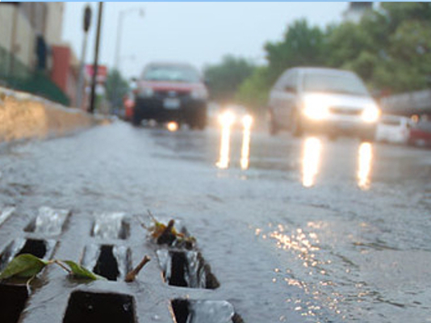
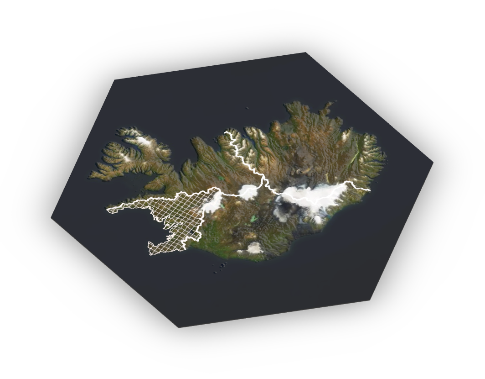

layout: false
class: split-two with-thick-border border-cyan
.column.bg-white[
  .split-two[
.row.bg-white[.content.vmiddle[.center[
  .nopadding[
.img-fill[]
]
  ]]]
  .row.bg-white[.content.vmiddle[.center[
  .nopadding[
.img-fill[]
]
  ]]]
]]

.column.bg-main1[.content.center.vmiddle[
# Microplastic Sampling
# .deep-orange[Skagaströnd] 
## .white[<span class=" faa-pulse animated-hover " style=" display: -moz-inline-stack; display: inline-block; transform: rotate(0deg);"> [skʰaːɣastrœn̥d] </span>]
<br><br>

```{r logo, echo=FALSE, message=FALSE, warning=FALSE, cache=FALSE,out.width = '50%'}
mynd <- knitr::include_graphics("images/zeropoint_logo.jpg")
mynd
```

]]

???
Takið eftir kaðlinum

---

```{r setup, include=FALSE}
options(htmltools.dir.version = FALSE)
```

layout: true
class: split-two with-border border-white

.column.bg-main3[.content[
  .split-five[
 .row.bg-main1[.content.center.vmiddle[
.font-dance.font3.black[Plastic is everywhere]
 ]]
  .row.bg-main2[.content.center[ It is made with <br>
.font-perm.font3[<span class=" faa-pulse animated faa-fast" style=" display: -moz-inline-stack; display: inline-block; transform: rotate(0deg);"> Chemistry!!]
 ]]
  .row.bg-main4[.split-two.content[
```{r wlogo, echo=FALSE, message=FALSE, warning=FALSE, cache=FALSE,out.width = '5%'}
mynd <- knitr::include_graphics("images/wikilogo.png")
mynd
```
.font-mono[The International Resin Identification Coding System (RIC) is a set of symbols that identify the plastic resin out of which products are made]
 ]]
  .row.bg-main2[.content.vmiddle[
## The term .red[microplastic] was coined in 2004 by Richard C. Thompson
 ]]
   .row.bg-main1[.content.center[
## Published international science articles about microplastics in growing numbers ever since.
 ]]
 ]
]]

.column.bg-white[.content.center.vmiddle[
{{content}}
]]

???
Define the layout and for sequence hide the appropriate cell.

---

class: hide-row2-col1 hide-row3-col1 hide-row4-col1 hide-row5-col1 with-thick-border border-white

```{r stortplast, echo=FALSE, message=FALSE, warning=FALSE,out.width = '100%'}
 
```
https://www.plasticstoday.com/
???
https://www.plasticstoday.com/sites/default/files/globe-plastic-bag-IRINA-Adobe-300.jpg

Plast er samofið öllum kimum samfélagsins. Það er órjúfanlegur þáttur í heilsukerfinu og það léttir faratæki í lofti, á landi og láði. 


---

class: hide-row1-col1 hide-row3-col1 hide-row4-col1 hide-row5-col1 with-thick-border border-white


```{r bakelite, echo=FALSE, message=FALSE, warning=FALSE, out.width='75%'}
knitr::include_graphics("https://thumbs.gfycat.com/BaggyWarlikeAmericancrow-size_restricted.gif")
```

```{r styrene-b, echo=FALSE, message=FALSE, warning=FALSE, out.width='75%'}

```


???
https://www.youtube.com/watch?v=BCNWav12PdI

I don't know anything about chemistry but this is to show how the first plasticresin is made from liquid materials (phenol, formaldehyde and sulfuric acid) wich led to bakelite

Plastic is made with polymerisation of oil-derived materials

Fyrsta plastefnið, Bakelite, var fundið upp um aldamótin 1900 Fenól og formaldehýð hitað og hrært saman við brennisteinssýru til að mynda fenólformaldehýðresín sem er fyrsta plastefnið eða plastresínið.
---

class: hide-row1-col1 hide-row2-col1 hide-row4-col1 hide-row5-col1 with-thick-border border-white


```{r framleidsla, echo=FALSE, message=FALSE, warning=FALSE, out.width='100%'}
library(kableExtra)
haus <- c('Plastic Type','Abbreviation','World Production', 'Resin Code (RIC)')#,'Einliða resíns')

type = c(
  'Polyethylene terephthalate',
  'Polyethylene - density > 0,94 g/cm^3^',
  'Polyvinyl chloride',
  'Polyethylene - density < 0,94 g/cm^3^',
  'Polypropylene',
  'Polystyrene',
  'Other'
)

type.pdf = c(
  'Polyethylene terephthalate',
  'Polyethylene - High density',
  'Polyvinyl chloride',
  'Polyethylene - Low densityd',
  'Polypropylene',
  'Polystyrene',
  'Other'
)

abbro= c(
  'PET, PETE',
  'HD-PE, PE-HD',
  'PVC',
  'LDPE, PE-LD',
  'PP',
  'PS',
  ''
)

total=c(
  '7%',
  '15%',
  '16%',
  '17%',
  '23%',
  '7%',
  '15%'
)
# icon=c(icon1="",
#        icon2="",
#        icon3="",
#        icon4="",
#        icon5="",
#        icon6="",
#        icon7="")


icon=c(icon1='</img>',
       icon2='</img>',
       icon3='</img>',
       icon4='</img>',
       icon5='</img>',
       icon6='</img>',
       icon7='</img>')

tafla = cbind(type.pdf, abbro, total, icon)
dimnames(tafla)[2] <- list(haus)
rownames(tafla) <- NULL
tafla <- as.data.frame(tafla)

#DT::datatable(tafla, escape = FALSE)
 library(magrittr)
 knitr::kable(
   tafla,
   align = 'c',
   booktabs = T,
   escape = F,
   "html"
   ) %>%
  kable_styling("striped", full_width = FALSE)

```

???
Fyrsta plastefnið, Bakelite, var fundið upp um aldamótin 1900 Fenól og formaldehýð hitað og hrært saman við brennisteinssýru til að mynda fenólformaldehýðresín sem er fyrsta plastefnið eða plastresínið.
---
class: hide-row1-col1 hide-row2-col1 hide-row3-col1 hide-row5-col1 with-thick-border border-white


```{r homerss, echo=FALSE, message=FALSE, warning=FALSE,out.width = '100%'}
mynd <- knitr::include_graphics("images/thompson1930.png")
mynd
```

---
class: hide-row1-col1 hide-row2-col1 hide-row3-col1 fade-row4-col1 with-thick-border border-white
count: false

```{r pubtrend, echo=FALSE, message=FALSE, warning=FALSE, dev.args=list(bg="transparent"), out.width='100%', fig.align='center'}

par(mar=c(4,4,4,2))

roundUpNice <- function(x, nice=c(1,2,4,5,6,8,10)) {
  if(length(x) != 1) stop("'x' must be of length 1")
  10^floor(log10(x)) * nice[[which(x <= 10^floor(log10(x)) * nice)[[1]]]]
} # https://stackoverflow.com/questions/6461209/how-to-round-up-to-the-nearest-10-or-100-or-x

pub.trend <- read.csv("skjol/PubTrend.txt",sep = "\t")
pub.trend <- pub.trend[,1:2]
pub.trend <- pub.trend[rev(rownames(pub.trend)),]
maxtala <- max(pub.trend[,2])
require(RColorBrewer)
litir <- colorRampPalette(c('#d75f07','seashell','#069acc'))(dim(pub.trend)[1])
litir <- rev(litir)
bp <- barplot(pub.trend[,2],ylab='',xlab='',axes=F,beside=TRUE,ylim=c(0,maxtala*1.1))
abline(h=seq(0,roundUpNice(1.1*maxtala),roundUpNice(1.1*maxtala)/5), col = 'lightgray', lty = 3)
barplot(pub.trend[,2], main='Number of Peer Reviewed Articles on Microplastics Each Year ', ylab="Number of Articles", beside=TRUE, axes = F, col=litir ,ylim = c(0,maxtala*1.1),add=T);box()
axis(2,seq(0,roundUpNice(1.1*maxtala),roundUpNice(1.1*maxtala)/5),labels = seq(0,roundUpNice(1.1*maxtala),roundUpNice(1.1*maxtala)/5),las=2)
axis(1,bp,pub.trend[,1])
```


---

layout: true
class: split-three with-thick-border

.column.bg-main1[.content[

# .indigo[What is microplastic?]
.nopadding[
.img-fill[]
]
]]
.column.bg-main2[.content[
# .orange[Microplastic:] .black[all plastic particles smaller than] 
# .orange[<span class=" faa-tada animated " style=" display: -moz-inline-stack; display: inline-block; transform: rotate(0deg);"> 5 mm</span>]
<br>
## .orange[Very slow degradation] .black[in the marine environment]
<br>
### .black[Some particles] .red[float] .black[while others] .red[sink] .black[or drift in the ocean layers.]
### .black[Difficult] .yellow[to see] .black[ and challenging to study.]
]]
.column.bg-red[.content[
.yellow.font-pulp.font2[WHERE DOES MICROPLASTIC COME FROM?]
<br>
.img-fill[]
]]

???
Hafið er kalt og dimmt og því ekki góðar aðstæður fyrir niðurbrot.
Örplast getur borist langar leiðir í höfunum, bæði í yfirborðslögunum og á meira dýpi. Einhver mesti þéttleiki sem hefur fundist í botnseti var á Svalbarða.
---
class: show-100

???
Þetta er sýni úr sjávarseti og þarna má sjá þræði úr fatnaði eða veiðarfærum og fleiri plastagnir sem hafa verið teknar frá öllu hinu gumsinu í sýninu.
---
class: show-110

???
Örplast er jafn fjölbreytt og plast er almennt og það er flest hannað til þess að endast
---
count: false

???
Erfitt að sjá og vandasamt að rannsaka. Við hjá Biopol fengum að kynnast því :)
Við höfum ekki ennþá sammælst um standard aðferðir við að greina örplast

---

layout: false
class: split-33

.column.bg-main3[.content.vmiddle.right[
.white[
# Main Sources
]
 .font-mono.font2[
 .red[Tirewear Particles]<br>
 .amber[Road Paint]<br>
 .red[House Paint]<br>
 .amber[Artificial Turf and Playgrounds]<br>
 .red[Laundry]<br>
 .amber[Cosmetics]<br>
 .red[Fishing Gear]<br>
 .amber[Plastic Waste on the Coastline]
]]]
.column[.content[
.center[
```{r echo=FALSE, message=FALSE, warning=FALSE, out.width="85%"}
knitr::include_graphics("images/samansetning.png")
```

]]]


???
Fishing gear needs closer attention
Veiðarfæri þarf að rannsaka betur. Sum veiðarfæri trosna við notkun og losnar nælon ofl. örplast þannig beint í hafið. Þetta er ekki flókinn iðnaður þá að hann sé stórtækur og því ætti að vera hægt að fylgjast betur með því hve mikið af veiðarfærum er í umferð
Fjörurnar eru eins og verksmiðjur sem mala örplast úr stærra plastrusli

Samsett mynd:
https://www.abc.net.au/news/2019-09-26/delicate-washing-cycle-releases-microplastics/11551356
...ofl.
---

layout: false
class: split-33

.column.bg-main3[.content.vmiddle.center[
.white[
# Main Pathways
]
]]
.column[.content.vmiddle.center[
.center[
.img-contain[]
.img-fill[]
]]]


???
In urban areas more runoff-water flows through the sewage
---

layout: false
class: split-33

.column.bg-main3[.content.vmiddle.center[
.white[
# Main Pathways
]
]]
.column[.content.vmiddle.center[
.center[
.img-contain[]
.img-fill[]
]]]


???
In urban areas more runoff-water flows through the sewage
---

layout: false
class: split-33

.column.bg-main3[.content.vmiddle.center[
.white[
# Main Pathways
]
]]
.column[.content.vmiddle.center[
.center[
.img-contain[]
.img-cover[)]
]]]


???
In urban areas more runoff-water flows through the sewage

Hafið er kalt og dimmt og því ekki góðar aðstæður fyrir niðurbrot.
Örplast getur borist langar leiðir í höfunum, bæði í yfirborðslögunum og á meira dýpi. Einhver mesti þéttleiki sem hefur fundist í botnseti var á Svalbarða.

Í dreifbýli rennur ofanvatn að mestu í jarðveg. .orange[Helstu farleiðir] örplasts á Íslandi eru í þéttbýli, þar sem það berst með ofanvatni í fráveitukerfin og þaðan til hafs.

Á suðvesturhorni landsins er vatnasvæði sem rennur í Faxaflóa (sjá mynd 3.1). Á því svæði býr yfir 3/4 hlutar landsmanna3 og þar er summa árdagsumferðar rúmir 3/4 hlutar á landsvísu. Flatarmál bygginga þar er yfir 50% flatarmáls allra bygginga á landsvísu74 en flatarmál málaðra flata eflaust enn meiri vegna byggingarhæðar. Flestir landsmenn fara til Reykjavíkur reglulega til að sækja þjónustu sem þar er í boði, nær allir vöruflutningar eru um svæðið og nærri allt millilandaflug. Þrír stórir slippir af fjórum eru á Höfuðborgarsvæðinu og í Grindavík. Það er því rík ástæða til að skoða þetta svæði betur.

[Mynd](https://reykjavik.is/sites/default/files/styles/frettamynd/public/myndir_frettir/frettamyndir_2014_febjuli/ellidaar_saevarhofdi_02.jpg?itok=Sq0ZT5d3)

Mynd birt með góðfúslegu leyfi Alta
---


layout: false
class: split-33

.column.bg-main2[.content.vmiddle[
.center[
# Main Sources of Microplastics
<br>
<br>
.font-mono[Estimates in tonnes]
]]]
.column[.content[
.center[
```{r echo=FALSE, message=FALSE, warning=FALSE, cache=FALSE, out.height="100%"}
#losun <- (l+h)/2 #Meðaltal lægra og hærra mats á losun.
value <- c(371, 41, 26, 33.2, 60, 3, 0.2, 8.2, 0.34, 1, 0.002) #Uppspretta lægra mat
losun <- c(164, 5.7,  0, 15.2, 3.2, 0.3, 0, 8.2, 0.34, 0, 0.002) #losun lægra mat
#value <- c(379,586,38,233,21,48,3,11,8,32,0.3,3)
heiti <- c('Car tires ',
          'Road paint ',
          'Airplane tires ',
          'House paint ',
          'Ship paint ',
          'Artificial turf ',
          'Playgrounds ',
          'Laundry ',
          'Cosmetics ',
          'Hail shots ',
          'Landfill leachates ')
land <- value-losun
df <- data.frame(heiti,land,losun)
df <- df[order(df$heiti),]

library(networkD3)
nodes <- c(levels(df$heiti), 'Land','Sea')
nodes <- as.data.frame(nodes)
names(nodes) <- "name"

a <- list()
for (i in 1:nrow(df)) {
  a[i] <- list(rbind(matrix(c(df[i,c(2,3)]))))
}
b <- do.call(c,a)
value <- unlist(b)

links <- 
  data.frame(
    source=c(0,0,1,1,2,2,3,3,4,4,5,5,6,6,7,7,8,8,9,9,10,10),
    target=c(rep(c(11,12),11)),
    value=value)


Sank <- list(nodes, links)
names(Sank) <- c('nodes', 'links')
sn <- sankeyNetwork(
  Links = Sank$links,
  Nodes = Sank$nodes,
  Source = "source",
  Target = "target",
  Value = "value",
  NodeID = "name",
  units = "tonn",
  colourScale = JS("d3.scaleOrdinal(d3.schemeCategory20);"),
  fontSize = 20,
  nodeWidth = 30, height = "681px", fontFamily = "Monospace"
)
rammi <- widgetframe::frameWidget(sn)
rammi

```

]]]

???
fig.cap='Helstu uppsprettur örplasts á Íslandi og skipting þess eftir farleiðum í haf eða í jarðveg. Byggt á lægra mati.',
Dekkjakurl berst til hafs í gegnum ræsi í þéttbýli en festist að mestu í jarðveginum við vegina. Stærsta uppspretta örplasts í umhverfinu á Íslandi, sem lagt var mat á, er tengd bifreiðaumferð. Slit á dekkjum og vegmerkingum er um 60-85% örplastslosunar á Íslandi.
Vegmerkingar berast með sömu leiðum til hafs
Útimálning berst einnig með affallsvatni gegnum ræsi en innimálningu er gjarnan hellt beint í niðurföll og berst þaðan í sjóinn
Gervigras "mælt með því að á keppnisvöllum sé árlega bætt við 3-5 tonnum af fylliefni"
---

layout: true
class: split-two with-border border-white

.column.bg-main3[.content[
  .split-five[
 .row.bg-main1[.content.left[
* .yellow[The soles] of tires are made of a synthetic rubber blend. 
* .yellow[Tirewear and road particles] along with .yellow[road paint] are the most studied and can be applied to Icelandic conditions.
* These particles range mostly from 10-100 µm (bigger than aerosol)
 ]]
  .row.bg-main2[.content.left[
* On road no. 1 around thi island and along country roads 90% of road runoff goes to the soil and 10% to surface water
* In urban areas the ratio is closer to 40% to soil and 60% to the sewers.

 ]]
  .row.bg-main4[.content[
#### Overspray and flakes of old washed-off ship paint settles around in shipyards. This may be an important source of microplastic pollution. One large ship requires tonnes of paint every couple of years. 
 ]]
  .row.bg-main2[.content[
### Synthetic fibers go unhindered through almost all sewage systems in Iceland. The data has come to age.
 ]]
   .row.bg-main1[.content[
### Örplast frá snyrtivörum er aðallega vegna handsápu af verkstæðum. 
 ]]
 ]
]]

.column.bg-white[.content.center.vmiddle[
{{content}}
]]

???
Define the layout and for sequence hide the appropriate cell.

---

class: hide-row2-col1 hide-row3-col1 hide-row4-col1 hide-row5-col1 with-thick-border border-white

```{r vegmerkingar, echo=FALSE, message=FALSE, warning=FALSE, cache=FALSE,out.width = '60%',fig.show='hold'}
 knitr::include_graphics(c("images/vegmerkingarorplast.png","images/twp.png"))

```

???

Stærsta uppspretta örplasts í umhverfinu á Íslandi, sem lagt var mat á, er tengd bifreiðaumferð. Slit á dekkjum og vegmerkingum er um 60-85% örplastslosunar á Íslandi. 

---

class: fade-row1-col1 hide-row3-col1 hide-row4-col1 hide-row5-col1 with-thick-border border-white


```{r  echo=FALSE, message=FALSE, warning=FALSE, fig.cap="Microplastic release on land and in the ocean"}

slit=c(244,34,22,79) 
losun=c(106,15,9,34)
land=slit-losun

library(networkD3)
A <- c("Small Vehicles ","Delivery Van ","Buses ","Lorrys ","Land ","Ocean ")
nodes <- as.data.frame(A)
names(nodes) <- "name"
#nodes$name <-  as.character(nodes$name)
links <- data.frame(source=rep(0:3,2),target=rep(4:5, each=4),value=c(land,losun))

Sank <- list(nodes, links)
names(Sank) <- c('nodes', 'links')
sn <- sankeyNetwork(
  Links = Sank$links,
  Nodes = Sank$nodes,
  Source = "source",
  Target = "target",
  Value = "value",
  NodeID = "name",
  units = "tonn",
  colourScale = JS("d3.scaleOrdinal(d3.schemeCategory20);"),
  fontSize = 28,
  nodeWidth = 30, width = "500px", height = "500px", fontFamily = "Courier"
)
#sn
library(widgetframe)
rammi <- frameWidget(sn)
rammi

```

???
Á þjóðvegum og sveitavegum fari 90% af affallsvatni vega í jarðveginn og 10% í yfirborðsvatn; skurði, ár og læki Í þéttbýli hérlendis fari 40% af affallsvatni vega í jarðveginn en 60% í ræsi.
---

class: fade-row1-col1 fade-row2-col1 hide-row4-col1 hide-row5-col1 with-thick-border border-white


```{r slippur, echo=FALSE, message=FALSE, warning=FALSE, fig.show='hold',out.width = '50%', dev.args=list(bg="transparent"),fig.cap='Hull length vs. hull area. Pie chart shows hull area by size categorys of ships', fig.align='center' }
par(mar = c(4.6, 6, 0, 0))
Batar <- read.csv("skjol/batar.csv",fileEncoding = "UTF-8")
litlir <- Batar[Batar$Lengd<15,]
storir <- Batar[Batar$Lengd>30,]
adrir <- Batar[!rownames(Batar) %in% c(rownames(litlir),rownames(storir)),]
Batar$gerd <- ifelse(Batar$Lengd<15, "Small boats",ifelse(Batar$Lengd>15 & Batar$Lengd<30,"Medium boats","Larger ships"))

litura="#cb5600"
liturb="#28c1ff"

yLab=expression(paste("Hull Area ( ",m^2,")"))
xLab="Ship Length (m)"
plot(Batar$Lengd,(Batar$WSA),type='n', ylab = "",xlab="")
mtext(xLab,1,3,cex=2)
mtext(yLab,2,3,cex=2)
points(litlir$Lengd,(litlir$WSA),col=liturb, pch=18)
points(adrir$Lengd,(adrir$WSA),col=1)
points(storir$Lengd,(storir$WSA),col=litura, pch=19)
legend("topleft",c("Small boats <15m. N=972","Mid sized ships N=75","Larger ships >30m. N=99"),col = c(liturb,1,litura),pch = c(18,1,19),cex=2,bty='n')

# landi <- data.frame(
#   skr=c(2890,2889,2895,1868,2170,1902,2881,2882,2184),
#   L = c(54.75,54.75,54.75,56.86,64.55,55.6,80,81,66.96),
#   Breidd = c(13.5, 13.5, 13.5, 12.6, 12.8, 12.8, 17, 17, 13),
#   Brt= c(1827,1827,1827,1469.7,1845,1521,3672,3672,2160),
#   D = c(4.7, 4.7, 4.7, 7.7, 8, 8, 8.5, 8.5, 8.53)
# )
# 
# landi2 <- Batar[Batar$Skipaskrárnúmer %in% landi$skr,]
# points(landi2$Lengd,landi2$WSA,pch=13,cex=2,col=2) #Skip HBGranda

par(mar = c(0, 0, 0, 0))
require(plyr)
kaka <- ddply(Batar,.(gerd),summarise,Flatarmal=sum(WSA))
pie(kaka$Flatarmal,labels = kaka$gerd, border="grey",col = c("transparent",liturb,litura),cex=2,radius = 0.6)
```

---
class: fade-row1-col1 fade-row2-col1 fade-row3-col1 hide-row5-col1 with-thick-border border-white


```{r gervigras, echo=FALSE, message=FALSE, warning=FALSE,out.width = '50%'}
mynd <- knitr::include_graphics("images/DEFALCO2018.jpg")
mynd
```

---
class: fade-row1-col1 fade-row2-col1 fade-row3-col1 fade-row4-col1 with-thick-border border-white


```{r homer, echo=FALSE, message=FALSE, warning=FALSE,out.width = '100%',fig.show='hold'}
mynd <- knitr::include_graphics(c("images/thok.png","images/burstathrif.png"))
mynd
```

---

layout: false
class: split-33

.column.bg-main5[.content.vmiddle.center[
.white[

]
]]
.column[.content.vmiddle.center[
.center[

]]]


???
In urban areas more runoff-water flows through the sewage

---

layout: false
class: split-two 

.column.bg-main1[.content[
## Fishing gear
```{r echo=FALSE, message=FALSE, warning=FALSE, out.width='100%'}
knitr::include_graphics("images/veidarf.png")
```


+ As much as 7,000 tonnes in Icelandic seas

+ 1,300 tonnes of fishing gear put in waste management

+ If only 0.5-1% wears off the microplastic pollution is considerable

]]


.column[.bg-white[.content[
## The coast

```{r ospartafla, echo=FALSE, message=FALSE, warning=FALSE, cache=TRUE,, dev.args=list(bg="transparent"), fig.cap='Trash on the Icelandic coastline. Data: OSPAR.'}
ospar <- read.csv("skjol/ospar.csv")
df <-
data.frame(
"Dags.(ár-mán-dag)" = as.Date(ospar[, 5], format = "%d/%m/%Y"),
Place = ospar[, 2],
Plastic =  rowSums(ospar[, substr(colnames(ospar), 1, 7) == "Plastic"]),
Rubber = rowSums(ospar[, substr(colnames(ospar), 1, 6) == "Rubber"]),
Textile = rowSums(ospar[, substr(colnames(ospar), 1, 5) == "Cloth"]),
Paper = rowSums(ospar[, substr(colnames(ospar), 1, 5) == "Paper"]),
Wood = rowSums(ospar[, substr(colnames(ospar), 1, 4) == "Wood"]),
Metal = rowSums(ospar[, substr(colnames(ospar), 1, 5) == "Metal"]),
check.names = FALSE
)

# if (knitr::is_latex_output()) {
library(dplyr)
library(tidyr)

ldf <- df %>% gather(Efni, fjoldi, 3:8)
plot(factor(ldf$Efni), ldf$fjoldi,ylab="Number of items")
#rass <- data.frame(ldf$`Dags.(ár-mán-dag)`,ldf$Efni,ldf$fjoldi)
#colSums(prop.table(t(matrix(rass$ldf.fjoldi,ncol = 18,byrow = T,dimnames = list(c(unique(rass$`Dags.(ár-mán-dag)`),as.character(unique(rass$ldf.Efni))))))))


# } else {
# library(DT)
# datatable(df[order(df[, 3], decreasing = T), ]) %>%
# formatStyle(
# names(df)[3:8],
# background = styleColorBar(range(df[, 3:8]), '#cb5600'),
# backgroundSize = '98% 88%',
# backgroundRepeat = 'no-repeat',
# backgroundPosition = 'center'
# )
#
# }


```


+ 95% plastic
+ Data still lacking
+ OSPAR records no. of items but not weight


]]]

???
Orkumikil kerfi sem virka eins og myllur fyrir örplast


Losun örplasts fer eftir því hvernig veiðarfæri um ræðir en sum þeirra slitna og missa þræði við notkun í mismiklum mæli. Aðrar gerðir veiðarfæra líkt og grásleppunet og handfæralínur slitna ekki með þeim hætti. Í sænskri rannsókn var losun örplasts metin 1-10% af heildarþyngd veiðarfæra
Minnast á sjókvíaeldi
---

layout: false
class: bg-main1 

# Thanks for listening!
.font2[
*  .yellow[The report] can be attained here [`r anicon::faa('external-link-alt', animate='float', rtext='MP report')`](https://harkanatta.github.io/orplastskyrslaUAR/) (*in Icelandic*)
* .yellow[The Github repo] is here [`r anicon::faa("github", animate="vertical")`](https://github.com/harkanatta/orplastskyrslaUAR) 

* This presentation was made with the R Package [Xaringan](https://github.com/yihui/xaringan) after a [template](https://emitanaka.org/ninja-theme/themes/kunoichi/kunoichi-theme-example.html) by Emi Tanaka
* This project was made for [The ministry for the environment and natural resources](https://www.government.is/ministries/ministry-for-the-environment-and-natural-resources/)
] 

