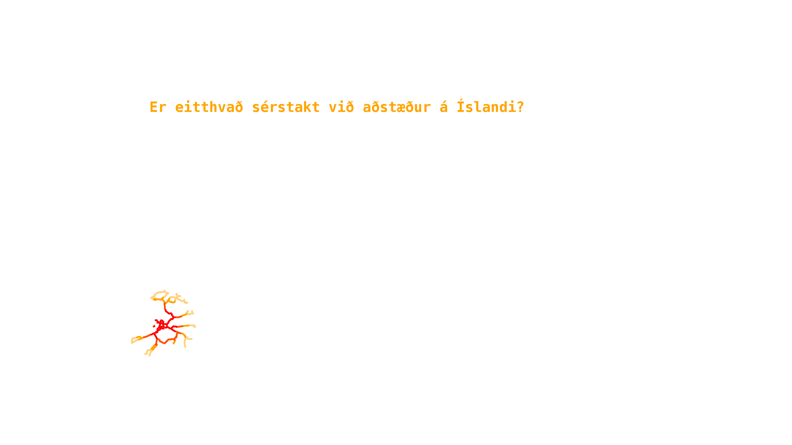

class: center, top
background-image: url("https://thumbs.gfycat.com/PersonalInfantileCuckoo-size_restricted.gif")
background-size: 100%
.content.vmiddle[
.center[
# .yellow[Main Sources and Pathways of Microplastics]
## .yellow[in Icelandic Oceans]
### .white[Made for the Environmental Ministry of Iceland] 

##  


]]

.bottom_abs[.footer-note[.tiny[.green[Image Credit: ][tactical_hog](https://gfycat.com/personalinfantilecuckoo)]]
]

???
<!-- background-image: url("https://thumbs.gfycat.com/PersonalInfantileCuckoo-size_restricted.gif") -->
Hæ, my name is
This is a talk about the main sources of MP's in Iceland and their pathways to the ocean. It's taken from a report that the companies/institutions I work for did for the environmental ministry of Iceland.

---

layout: false
class: split-two with-thick-border border-cyan

.column.bg-main1[
.split-two[

.row.bg-main1[.content.vmiddle[
.center[
.nopadding[
.img-fill[]
]]]]

.row.bg-main1[
.content.vmiddle[.center[
.nopadding[
.img-fill[]
]]]]
]]

.column.bg-main1[
.split-two[

.row.bg-main1[.content.vmiddle[
.center[
.nopadding[
.img-fill[]
]]]]
.row.bg-main1[

.content.vmiddle[
.center[
 ##  and  Microplastic research:
 ## .orange[Sampling `r icon::octicons$beaker`] and .yellow[Analyzing `r icon::octicons$graph`]
 ## Desktop studies and Reports `r icon::octicons$device_desktop`

]]]]]


???
Backstroy:
A quick backstory on how this project came to me or us. Well, Biopol had done environmental sampling of plankton (both phytoplankton and zooplankton) for several years and these particles and threads had always been there in the samples and we would think none of it until one of us heard about MP's in 2011 and started counting the particles. Then later we noticed that fibers from our sampling gear and our clothes were detectable in our samples so we upgraded our methods to meet the relevant standards of MP sampling and also the purification of the samples and today, we go through the whole process, from sampling to analyzing spectral data.

---

layout: true
class: split-three with-thick-border

.column.bg-red[.content.center.vmiddle[
.yellow.font-pulp.font2[WHERE DO MICROPLASTICS COME FROM?]
<br>
.img-fill[]
.bottom_abs[.footer-note[.tiny[.green[Image Credit: ][CJ_Productions](https://www.reddit.com/r/cutouts/comments/3u9prd/travolta_cutout_technically_gif_format_optimized/)]]
]
]]


.column.bg-main1[.content.center.vmiddle[
# Many Sources

.img-fill[]


]]


.column.bg-main2[.content.center.vmiddle[
# Few Main Pathways

.img-fill[]

.bottom_abs[.footer-note[.tiny[.green[Image Credit: ][Rvk](https://reykjavik.is/frettir/abyrgd-synd-vid-bilathvott-og-medferd-efna)]]
]
]]


???
Well were does mp pollution in Icelandic seas come from?
We began to look into the literature for Pathways and sources to see where microplastics might be coming from and how they reach the ocean. 
There are many different sources of MP's that are important depending on the pathway they travel to the ocean.
We can't separate the sources from the pathways since it had to reach the ocean by some means

---
class: show-100


---
class: show-110


---
count: false


---
layout:false
class: split-40 bg-white with-border

.row[.center[

].top_abs[.tiny[[ALTA](https://www.alta.is/)]]]
.row[
  .split-three.with-border[
  .column.bg-main1[.content[
  <br>
  <br>

    ]]
  .column.bg-white[.content[
 .font2.center[💦**Running water is the main pathway for MPs**]

.font_large[
* Sewage
* Rivers and streams
* Beach litter
* Wind 🌬️
]

  ]
.tiny.font-dance.center[More on thet later]
  ]
  .column.bg-main4[.content[
  <br>
  <br>
  
  ]]
]]

???
Running water is the most important pathway for mp to the ocean, mostly through sewage but also at some level, rivers and streams. Beach litter is a grinding machine for larger plastic objects into mp. Wind also plays a role but many questions need answering especially when it come to very small, even nano-sized particles.
---

layout: false
class: split-33

.column.bg-main4[
.content.vmiddle.right[
.black[
# Main Sources of MP's
categories
]
 .font-mono.font_medium[
 .red[Tirewear Particles]<br>
 .black[Road Paint]<br>
 .red[House Paint]<br>
 .black[Artificial Turf and Playgrounds]<br>
 .red[Laundry]<br>
 .black[Cosmetics]<br>
 .red[Fishing Gear]<br>
 .black[Plastic Waste on the Coastline]
]]]
.column.content.center[
.figb80[]
]

???

So lets dive into the sources. The main MP's sources in Iceland are the usual suspects
---

layout: false
class: split-33

.column.bg-main2[.content.vmiddle[
.center[
# Estimates of the Main Sources of Microplastics
<br>
<br>
.font-mono[Lower estimate]
<br>
.font-mono[Tonnes per year]
]]]

.column[.content.vmiddle.center[

```{r SankBig, echo=FALSE, fig.cap="Microplastic", message=FALSE, warning=FALSE, out.width='100%'}
#losun <- (l+h)/2 #Meðaltal lægra og hærra mats á losun.
slit=c(371, 41, 26, 33.2, 60, 3, 0.2, 8.2, 0.34, 1, 0.002)
losun= c(164, 5.7,  0, 15.2, 3.2, 0.3, 0, 8.2, 0.34, 0, 0.002)
land=slit-losun
library(networkD3)
A <-  c("Car tires ","Road paint ","Airplane tires ","House paint ","Ship paint ","Artificial turf ","Playgrounds ","Laundry ","Cosmetics ","Hail shots ","Landfill leachates ","Land ","Ocean ")
nodes <- as.data.frame(A)
names(nodes) <- "name"
#nodes$name <-  as.character(nodes$name)
links <- data.frame(source=rep(0:10,2),target=rep(11:12, each=11),value=c(land,losun))
Sank <- list(nodes, links)
names(Sank) <- c('nodes', 'links')
sn <- sankeyNetwork(
  Links = Sank$links,
  Nodes = Sank$nodes,
  Source = "source",
  Target = "target",
  Value = "value",
  NodeID = "name",
  units = "tonn",
  colourScale = JS("d3.scaleOrdinal(d3.schemeCategory20);"),
  fontSize = 28,
  nodeWidth = 30, width = "681px", height = "678", fontFamily = "Courier"
)
#sn
library(widgetframe)
rammi <- frameWidget(sn)
rammi
```

]]

???
These are the estimates most important sources of MP's accdording to our study.
(Move the bars around)
We divide them with respect to their fate or where they end up eventually, if they fall into soil or landfill for example or if they're delivered straight to the ocean.
You can see, for example, how the shedding of MP particles from laundry goes almost exclusively to the ocean via sewage while the majority of the much greater source, car tires, end up mostly in soil on land.
Confidence intervals are not presented in this visualization and these are the lower estimates of a large error margin.

---

layout:false
class: split-30 hide-slide-number
background-image: url("images/blandabru.jpg")
background-size: cover

.column.slide-in-left[
.sliderbox.shade_main.center[
.font5.font-dance[Traffic]]]
.column[
]

.bottom_abs[.footer-note[.tiny[.green[Image Credit: ][Robbi Dan](https://www.flickr.com/photos/robbidan/)]]
]

???
Traffic
This is the main road that circles the country, going over the river Blanda in the northern part of the country. 60 to 85% of mp sources come from traffic.

---

layout: true
class: split-40

.column.bg-main3[.content[
  .split-three[
 
 .row.bg-main1[.content.left.font_medium[
* .blue[The soles] of tires are made of a synthetic .blue[rubber blend] which is released in traffic.
* .blue[Tirewear and road particles] along with .blue[road paint] are well studied emission sources and can be applied to Icelandic conditions.
* These particles range mostly from .blue[10-100 µm] (bigger than aerosol)
 ]
 .bottom_abs[.footer-note[.tiny[.green[Image Credit: ][Kreider 2010](https://www.sciencedirect.com/science/article/pii/S0048969709009590)]]]
 ]
 
  .row.bg-main2[.content.left[
* .font_medium[.blue[Numbers] of vehicles, types and weight (Icelandic transport authority)]
* .font_medium[Estimates of .blue[wear] of tyres] .tiny[(Klein 2017)]
* .font_medium[Estimates of .blue[emissions]] .tiny[(Vershoor 2016)]

 ]]
 
 
   .row.bg-main2[.content.left.font_medium[
* .blue[The Icelandic road (and coastal) administration] **IRCA** oversees the majority of the roadsystem 
* All midlines painted yearly. 
 - Weather conditions and snow plowing
* New roads account for approx. 13%
* Polymer ingredient uncertain - .red[large margin of error]

 ]]
 
 

 
]]]


.column.bg-white[.content.center.vmiddle[
{{content}}
]]


---

class: hide-row2-col1 hide-row3-col1 with-thick-border border-white

# Car tyres


```{r vegmerkingar1, echo=FALSE, message=FALSE, warning=FALSE, cache=FALSE,out.width = '51%',fig.show='hold'}
 knitr::include_graphics(c("images/tyre.jpg","images/Kreider_et_al_2010.png"))
```


???

Lets start with the biggest source, car tyres. The asphalt scrapes the rubber of the tyres like sandpaper, mixing in with them and forming these little turd-like particles that you see on the image. Theese particle are to big for aerosol so they're mostly carried away with road run-off, either into the soil, to the sewer or some waterway or stream.

---

class: fade-row1-col1 hide-row3-col1 with-thick-border border-white

```{r SankSmall, echo=FALSE, fig.cap="Microplastic", message=FALSE, warning=FALSE, out.width='100%'}
slit=c(244,34,22,79) 
losun=c(106,15,9,34)
land=slit-losun
library(networkD3)
A <- c("Small Vehicles ","Delivery Vans ","Buses ","Lorrys ","Land ","Ocean ")
nodes <- as.data.frame(A)
names(nodes) <- "name"
#nodes$name <-  as.character(nodes$name)
links <- data.frame(source=rep(0:3,2),target=rep(4:5, each=4),value=c(land,losun))
Sank <- list(nodes, links)
names(Sank) <- c('nodes', 'links')
sn <- sankeyNetwork(
  Links = Sank$links,
  Nodes = Sank$nodes,
  Source = "source",
  Target = "target",
  Value = "value",
  NodeID = "name",
  units = "tonn",
  colourScale = JS("d3.scaleOrdinal(d3.schemeCategory20);"),
  fontSize = 28,
  nodeWidth = 30, width = "500px", height = "400px", fontFamily = "Courier"
)

library(widgetframe)
rammi <- frameWidget(sn)
rammi
```

```{r akstur, echo=FALSE, cache = TRUE}
library(RColorBrewer)
options(OutDec = ",")
# Heildarþyngd ökutækis: Þyngd ökutækis eða vagnlestar með ökumanni, farþegum, farmi og viðfestum vinnutækjum.


bifreidar <- matrix(c(227409,23159,2410,8078,2049,2661,9746,17181,12601,14251.6,33693.6,17832,85,102,267,546,132,159,415,850),5,4,byrow = T)

slit_lagt <- bifreidar[1,]*bifreidar[3,]*bifreidar[4,]/1000000000 #Fjöldi*meðalakstur*(slit (mg/ári) lægri talan)
losun_lagt <- c()
  for (i in 1:length(slit_lagt)) {
  losun_lagt[i] <- (2/3)*slit_lagt[i]*0.6+(1/3)*slit_lagt[i]*0 #Verschoor2016
}
slit_lagt <- round(slit_lagt,0)
losun_lagt <- round(losun_lagt,0)

slit_hatt <- bifreidar[1,]*bifreidar[3,]*bifreidar[5,]/1000000000 #Fjöldi*meðalakstur*(slit (mg/ári) hærri talan)
losun_hatt <- c()
for (i in 1:length(slit_hatt)) {
  losun_hatt[i] <- (2/3)*slit_hatt[i]*0.6+(1/3)*slit_hatt[i]*0 #Verschoor2016
}
slit_hatt <- round(slit_hatt,0)
losun_hatt <- round(losun_hatt,0)

slit_ari <- ifelse(slit_hatt>slit_lagt,paste(slit_lagt,slit_hatt,sep = "-"),paste(slit_hatt,slit_lagt,sep = "-"))
losun_ari <- ifelse(losun_hatt>losun_lagt,paste(losun_lagt,losun_hatt,sep = "-"),paste(losun_hatt,losun_lagt,sep = "-"))

bifreidar[2,] <- round(bifreidar[2,]/1000,2)
bifreidar[3,] <- round(bifreidar[3,]/1000,2)
bifreidar <- rbind(bifreidar[1:3,],paste(bifreidar[4,],bifreidar[5,],sep="-"),slit_ari,losun_ari)

colnames(bifreidar) <- c("Small Vehicles","Delivery Vans","Buses","Lorrys")
rownames(bifreidar)<- c("Number","Mean weight (t)","Average usage (K km/year)","Wear & tear (mg/km)", "Wear & tear (t/year)", "Release to ocean (t/year)")


#bifreidar <- rbind(icon[c(1,2,3,4)],bifreidar)
bifreidar <- format(bifreidar,  decimal.mark=",", big.mark=".", scientific=FALSE)

if (knitr::is_html_output()) {
   knitr::kable(bifreidar, booktabs=T, caption = ".")

} else {
  rownames(bifreidar)<- c("Fjöldi","Meðalþyngd (t)","Meðalakstur (þús. km/ár)","Slit (mg/km)", "Slit (t/ár)", "Losun í hafið (t/ár)")
 knitr::kable(bifreidar, caption = "Áætluð árleg losun örplasts í hafið vegna slits á hjólbörðum bifreiða. Fjöldi bíla af mismunandi gerðum í umferð á Íslandi þann 14. ágúst 2018 og meðalakstur skv. Umferðastofu. Með meðalþyngd er átt við heildarþyngd skv. reglugerð. Byggt á mati Klein (2017) og Verschoor (2016)",format = 'latex', booktabs=T)
   }
options(OutDec = ".")

```


???

To estimate the total source of microplastics from car tyres, data from the Icelandic transport authority was used with estimates of wear of tyres for different size classes of vehicles. To evaluate how much of it could possibly end up in the ocean estimates of emissions were used.

---

class: fade-row1-col1 fade-row2-col1 with-thick-border border-white


```{r vegmerkingSank, eval=FALSE, include=FALSE, echo=FALSE, fig.cap="Road paint", message=FALSE, warning=FALSE, out.width='100%'}
nodes <- c('Larger mun. ','Smaller mun. ','IRCA ','Thermopl. ','Paint ','Source low est. ','Source high est. ','Ocean','Ocean','Land','Land')
nodes <- as.data.frame(nodes)
names(nodes) <- "name"
#nodes$name <-  as.character(nodes$name)
links <- data.frame(source=c(0,1,2,2,3,4,3,4,5,6,5,6),target=c(3,4,3,4,5,5,6,6,7,8,9,10),value=c(110,15,543,218,6,35,163,93,5.7,42.6,35,213))
rass <- list(nodes,links)
names(rass) <- c('nodes','links')
sn <- sankeyNetwork(Links = rass$links,
                    Nodes = rass$nodes,
                    Source = "source",
                    Target = "target",
                    Value = "value",
                    NodeID = "name",
                    units = "Tonn",
                    colourScale = JS("d3.scaleOrdinal(d3.schemeCategory20);"),
                    fontSize = 28,
                    nodeWidth = 30, 
                    width = "500px", 
                    height = "400px", 
                    fontFamily = "Courier")

library(widgetframe)
rammi <- frameWidget(sn)
rammi
  
```


```{r vegagerd, echo=FALSE, message=FALSE, warning=FALSE, fig.show='hold',out.width = '70%', dev.args=list(bg="transparent") }

img <- 
img
```

???

Another large source of MP's in the transportation category is road paint. Road paint (both spray paint and thermoplastics) has plastic polymers as binding material in it. The road administration supplied available statistics based on their inventory of imported road paint. A few municipalities supplied us with documents so we could come up with an approximation of road paint in the country. There are different materials in use and polymer content is not always available.

---

layout:false
class: split-40 bg-white with-border

.row[.center[

].top_abs[.tiny[[ALTA](https://www.alta.is/)]]]
.row[
  .split-three.with-border[
  .column.bg-main1[.content[
  <br>
  <br>

    ]]
  .column.bg-white[.content.font2[

 A simple crude devition:
* On rural roads: .blue[90%] of road runoff goes to the .blue[soil] and .red[10%] to .red[surface water]
* In urban areas:.blue[40%] to .blue[soil] and .red[60%] to the .red[sewers].
  ]
  .bottom_abs.left[.tiny[(Klein 2017)]]
  ]
  .column.bg-main4[.content[
  <br>
  <br>
  
  ]]
]]

???

There haven't been many extansive studys on pathways of MPs, mainly because of difficulties with sampling, and certainly non such studys in Iceland. So to estimate how much of the sources that don't go directly to the sea, reach the ocean, we used this rough devition between rural and urban. So lets say... if yearly traffic in two roads is them same number of cars but one road lies in the country side while the other runs through the city... the one that runs through the city contributes more mp emissions to the ocean because of the non-porous asphalt and sewers.
---

layout:false
class: bg-white

.center[

]

???
Is there any thing special about the pathways in Iceland? 
---
layout:false
class: bg-main1
.center[

]

???
We are in a very sparsely populated country (two thirds of the population live near Reykjavík) and we do not treat our sewage with the aim of reducing mp's. 
The most important pathways in Iceland, one might say, are therefore the sewage system and road run-off in Reykjavík.

---

layout:false
class: split-75 bg-white with-border


.row[
  .split-two.with-border[
  .column.bg-main1[.content[
  <br>
  .bottom_abs[.footer-note[.tiny[[Environment agency](https://tinyurl.com/y6b6x49y)]]]
  <br>


  ]]
  .column[.content.center.vmiddle[
Types of sewage treatment


  ]]
]]
.row[
# Most of the sewage is concentrated near Reykjavík. 
# .blue[Microplastics] are not treated as a concern *yet*
]

???
Here the sewage pipes of Rvk can be seen. Sewage is transported fram from shore where it is mixed in with the ocean. On the graph the different types of sewage treatments are color coded. A tall blue column can be seen that represents a sigle-step system that serves the Reykjavík area. No system at all is the most common one in all other parts of the country.


---


layout:false
class: split-20 hide-slide-number
background-image: url("images/skipamalning.jpg")
background-size: cover

.column.slide-in-left[
.sliderbox.shade_main.center[
.font-dance[.font5[Paint] .font2[and stuff]]]]
.column[

]

???
That's Eiríkur
 - Local fisherman in my village
 - He's painting the upper part of his boat (the boat must be hauled on land to paint the hull)
 - Eiríkur goes fishing all year round and paints the boat every year


---
layout: true
class: split-two with-border border-white

.column.bg-main3[.content[
  .split-three[

 .row.bg-main1[.content.left.font_medium[
* Smaller boats often .blue[painted by owners] every **3 to 5 years** - .font-dance[a few buckets]
* The hull (bottom side) is more frequently painted
* .blue[Polymer content] varies (30%-80%)
* Large margin of error.
 ]]
 
  .row.bg-main2[.content.left[
* .font_medium[Total wettet area of the Icelandic fleet `r icon::ionicons$boat`] .tiny[(Moser 2016)]
* .font_medium[**1 large ship** requires tonnes of paint every couple of years.]
* .font_medium[Overspray and flakes of .blue[old washed-off ship paint] settles around in shipyards.]
* .font_medium[Overall not a large source if shipyards follow .font-dance[proper etiquette] ]

 ].bottom_abs[.footer-note[.tiny[[Icelandic transport authority](https://www.icetra.is/)]]]]

  .row.bg-main4[.content.left.font_medium[

* .font_medium[**7.000 tonnes** in use in Icelandic waters] .tiny[(Hann 2018)] .font-dance[Gross overestimation] .tiny[(said somone at the Marine institute)]
* Different .blue[types] of filament shed at different .blue[rates]
* different .red[usage], .red[strain] and rate of deterioration
* Largely unknown

 ]]

 ]
]]

.column.bg-white[.content.center.vmiddle[
{{content}}
]]


---

class: hide-row2-col1 hide-row3-col1 with-thick-border border-white
## Ship paint
```{r litlislippur, echo=FALSE, message=FALSE, warning=FALSE, cache=FALSE,out.width = '90%'}
 knitr::include_graphics(c("images/lillibati.jpg","images/slippurb.jpg"))
```

???
There are a few tracks in the country near harbours where boats can be dragged up on land for a make-over.
Small boats are often kept on land over winter and painted by their owners with brushes and rolls before being put afloat again early spring. The hull of the boat is painted more frequently with water soluble paint that is not regarded as MP. 
Again, polymer content varies alot so the certainity isn't much.

---

class: fade-row1-col1 hide-row3-col1 with-thick-border border-white

```{r storuskipin, echo=FALSE, message=FALSE, warning=FALSE, out.width = '80%', fig.align='center' }

```

```{r slippurinn, echo=FALSE, message=FALSE, warning=FALSE, fig.show='hold',out.width = '45%', dev.args=list(bg="transparent"),fig.cap='Hull length vs. hull area. Pie chart shows hull area by size categorys of ships', fig.align='center' }
par(mar = c(4.6, 6, 0, 0))
Batar <- read.csv("skjol/batar.csv",fileEncoding = "UTF-8")
litlir <- Batar[Batar$Lengd<15,]
storir <- Batar[Batar$Lengd>30,]
adrir <- Batar[!rownames(Batar) %in% c(rownames(litlir),rownames(storir)),]
Batar$gerd <- ifelse(Batar$Lengd<15, "Small boats",ifelse(Batar$Lengd>15 & Batar$Lengd<30,"Medium boats","Larger ships"))
litura="#cb5600"
liturb="#28c1ff"
yLab=expression(paste("Hull Area ( ",m^2,")"))
xLab="Ship Length (m)"
plot(Batar$Lengd,(Batar$WSA),type='n', ylab = "",xlab="")
mtext(xLab,1,3,cex=2)
mtext(yLab,2,3,cex=2)
points(litlir$Lengd,(litlir$WSA),col=liturb, pch=18)
points(adrir$Lengd,(adrir$WSA),col=1)
points(storir$Lengd,(storir$WSA),col=litura, pch=19)
legend("topleft",c("Small boats <15m. N=972","Mid sized ships N=75","Larger ships >30m. N=99"),col = c(liturb,1,litura),pch = c(18,1,19),cex=2,bty='n')
# landi <- data.frame(
#   skr=c(2890,2889,2895,1868,2170,1902,2881,2882,2184),
#   L = c(54.75,54.75,54.75,56.86,64.55,55.6,80,81,66.96),
#   Breidd = c(13.5, 13.5, 13.5, 12.6, 12.8, 12.8, 17, 17, 13),
#   Brt= c(1827,1827,1827,1469.7,1845,1521,3672,3672,2160),
#   D = c(4.7, 4.7, 4.7, 7.7, 8, 8, 8.5, 8.5, 8.53)
# )
# 
# landi2 <- Batar[Batar$Skipaskrárnúmer %in% landi$skr,]
# points(landi2$Lengd,landi2$WSA,pch=13,cex=2,col=2) #Skip HBGranda
par(mar = c(0, 0, 0, 0))
require(plyr)
kaka <- ddply(Batar,.(gerd),summarise,Flatarmal=sum(WSA))
pie(kaka$Flatarmal,labels = kaka$gerd, border="grey",col = c("transparent",liturb,litura),cex=2,radius = 0.6)
```

???
Only a handfull of passenger ships are in Icelandic waters compared to the number of fishing ships so to calculate the amount of ship paint used in total in Icelandic seas we used data about ship length and an equation from another study. There are almost a thousand small boats registered in Iceland and a little under 200 large and medium sized ships, as can be seen on the graph. 
4 large shipyards are in Iceland (3 of them in the southwest near Reykjavík) that service up to a hundred ships every year (both Icelandic ships and ships from abroad).
Tonnes of flakes are scraped and power-washed in the shipyards but if they are scooped up properly and disposed of carefully then this mp source is a rather small source. We got contradicting information from staff in these shipyards, people pointed at each other saying they do it the right way but others dont. We give them the benefit of the doubt so ship paint is a rather small source of mp.

---

class: fade-row1-col1 fade-row2-col1 with-thick-border border-white

# Fishing Gear

```{r veidarf, echo=FALSE, message=FALSE, warning=FALSE, out.width = '100%', fig.align='center',fig.show = 'hold' }
knitr::include_graphics("images/kadlar.jpg")
```


???
Since we are on the topic of fisheries I want to mention fishing gear shortly. Maybe 7000 tonnes is a bit too high of an estimation. Someone at the marine institute said that compared to other countries Iceland had less fishing gear for every kg of cought fish. ...It is hard to estimate this particular source of mp since both the weight of total fishing gear and the rate of which it deteriorates and sheds mp is unknown. One source mentioned up to 10% of fishing gear weight could become mp pollution. even 1 % would make it a considerable amount 


---
layout:false
class: split-25 bg-white with-border

.row[.font5.center[Outdoor Paint]
]
.row[
  .split-three.with-border[
  .column[.content[
  <br>
  <br>

    ]]
  .column.bg-white[.content[
  
* .font2[.font-dance[Almost] .red[all roofs] and .red[every house] painted]
* .font2[Most of the polymers volatilized .font-dance[in the sun] .yellow[ `r icon::octicons$sun`]] .tiny[(Hann 2018)]
* .font2[Calculations based on ready-made imported paint]
 
  ]]
  .column[.content[
  <br>
  <br>

  ]]
]]

???
Most houses need painting especially on the southern side (the sunny, rainy side) and on the tin roofs. There are not many brick houses in Iceland. 
Most of the polymers in outdoor housepaint is volatilized over the course of its lifetime, since there are up to 10 years between paint jobs. Still flakes of paint settle on the ground either because of weathering or power washing and might be delivered to the ocean through sewage. Here, rural areas are left out because of lack of pathways for theese particles to reach the ocean.

---
layout:false
class: split-30 bg-white with-border

.row[.font5.center[Indoor Paint]
]


.row[
  .split-two.with-border[
  .column.bg-main1[.content[
#Paintbrush cleaning


    ]]

  .column.bg-orange[.content[
* .font2[Homeowners wash indoor paint .white[directly down the drain]]

* .font2[Estimated polymer content 20%] (Kole 2018)

* .font2[Data not available .font-dance[(paint is just paint)]]

* .font2[Calculations based on ready-made imported paint]
  ]]
]]

???
Indoor paint doesn't flake of the walls while the house still stands but it is washed down the drain. Data about polymer content wasn't easy to attain and it's not always registered for some lack of interest.

---
layout:false
class: split-33 hide-slide-number
background-image: url("images/household.jpg")
background-size: cover

.column.slide-in-left[
.sliderbox.shade_main.center[
.font5.font-dance[Households]]]
.bottom_abs[.footer-note[.tiny[.green[Image Credit: ][Ziko van Dijk](https://commons.wikimedia.org/wiki/File:201708_Hallgr%C3%ADmskirkja_b16.jpg)]]
.column[
]

???
Lets take a quick peek into the household before we wrap this up

---

layout:false
class: split-25 bg-white with-border

.row.center[
<br>
# Laundry

]

.row[
.split-two.with-border[
.column[
<br><br>
.content.left[.font_medium[.font-mono.shade_main[
|                       |(per year)|     Unit     |
|:----------------------|:--------:|:------------:|
|No. washes per home    |   165    |     Wash     |
|No. homes              | 120,000  |     Home     |
|Weight of wash         |   3-4    |      kg      |
|MP Particles           | 12-640   |     mg/kg    |
|Synthetics per wash    |  30-50   | %            |

]
<br>
* Direct source to the ocean .font-dance[ -mostly]
* Data has come of age
]
<br><br><br><br>
.tiny[(Pakula 2010, Magnusson 2016)]
]
]
.column[
<br><br>
.content[
.center[

.bottom_abs[.footer-note[.tiny[.green[Image Credit: ][Abrev](https://commons.wikimedia.org/wiki/File:Textilkennzeichnungab.jpg)]]
]
]]]]]

???
According to a study in 2010 (Pakula) Icelandic homes do their laundry 165 a year, medium weight of a single wash in the western world is between 3 and 4 kg and 30 to 50% sythetic clothing. Another study from sweden (2018) showed that for every kg of synthetic clothing 12 to 640 mg of mp shed off. So theese calculations are pretty straight forward. All washed straight to the ocean, nice and clean for data scientists but not so clean for the environment. Oh well some sewage is collected inland but that is a tiny proportion. Some of it might even be spread on farmland but that's another story...


---

layout: false
class: split-two bg-main1

.column.bg-main1[.content.center[
.font2.font-dance[Last but not least]
<br><br><br>


]]


.column[.bg-main1[.content[
# The Coast
.font2[
+ 95% plastic
+ Data still lacking
+ OSPAR monitoring
]
.center[

]
]]]


---

layout: false
class: split-75 bg-main1 

.row[
# Thanks for listening!
.font2[
*  .yellow[The report] can be attained here [`r icon::octicons$share`](https://harkanatta.github.io/orplastskyrslaUAR/) (*in Icelandic*)
* .yellow[The Github repo] is here [`r icon::simple_icons$github`](https://github.com/harkanatta/orplastskyrslaUAR) 

* This presentation was made with the R Package [Xaringan](https://github.com/yihui/xaringan) after a [template](https://emitanaka.org/ninja-theme/themes/kunoichi/kunoichi-theme-example.html) by Emi Tanaka
* This project was made for [the ministry for the environment and natural resources](https://www.government.is/ministries/ministry-for-the-environment-and-natural-resources/)
] 
]
.row.split-three[
.column[.content[

]]
.column[.content[
 
]]
.column[.content[
 
]]

]


