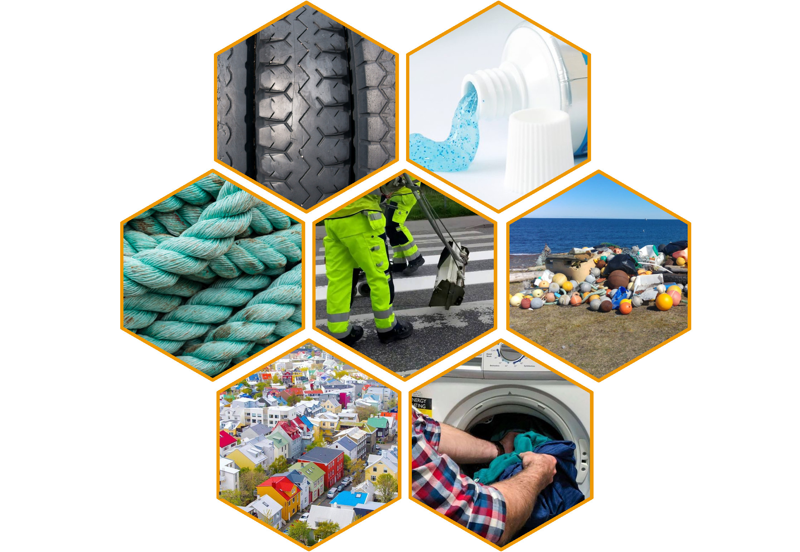
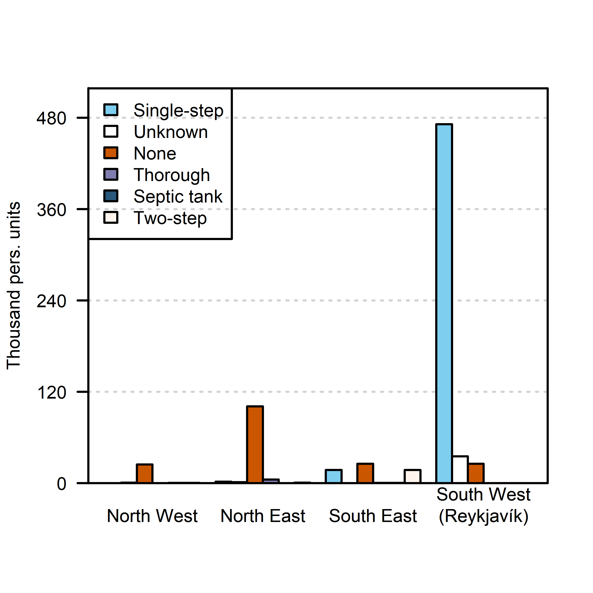

class: center, top
background-image: url("https://thumbs.gfycat.com/PersonalInfantileCuckoo-size_restricted.gif")
background-size: 100%
.content.vmiddle[
.center[
# .white[Örplast]
## .white[í náttúru Íslands]

## 


]]

.bottom_abs[.footer-note[.tiny[.green[Image Credit: ][tactical_hog](https://gfycat.com/personalinfantilecuckoo)]]
]

???
<!-- background-image: url("https://thumbs.gfycat.com/PersonalInfantileCuckoo-size_restricted.gif") -->
Hæ, my name is
This is a talk about the main sources of MP's in Iceland and their pathways to the ocean. It's taken from a report that the companies/institutions I work for did for the environmental ministry of Iceland.

---

layout: false
class: split-two 

.column.bg-main1[
.split-two[

.row.bg-white[.content.vmiddle[
.center[
.nopadding[
 
 ### NNV í samstarfi við BioPol
 ## Örplastrannsóknir:
 ### Sýnatökur, .blue[sanngreining],
 ### greinaskrif og skýrslur.
]]]]

.row.bg-main1[
.content.vmiddle[.center[
.nopadding[
.img-fill[]
]]]]
]]

.column.bg-main1[
.split-two[

.row.bg-main1[.content.vmiddle[
.center[
.nopadding[
.img-fill[]
]]]]

.row.bg-main1[.content.vmiddle[
.center[
.nopadding[
.img-fill[]
]]]]

```{r plot, eval=FALSE, message=FALSE, warning=FALSE, include=FALSE, out.width='100%'}
library(tidyverse)
presin <- read.csv("skjol/Polyethylene_resin_Cabernard_et_al_2018.csv")
ogn <- read.csv("skjol/Ogn_nr_13.csv")
ogn$Sýni <- 'Ögn nr. 13'
presin$Sýni <- 'Pólýetýlen resín \n(Cabernard et al. 2018)'

litir <- c('#f60000','#09428f')

p <- rbind(presin[,c(2,3,6)],ogn[ogn$wavenumber<2000,]) %>% 
  ggplot(aes(x=wavenumber, y=intensity, colour = Sýni)) +
  geom_line(size=1) +
  labs(x = bquote('bylgjutala'~(cm^-1)), y = "styrkleiki")+
  scale_color_manual(values = litir)+
  theme_bw()+
  theme(strip.text.x = element_blank(),
      strip.background = element_rect(colour="white", fill="white"),
      legend.position=c(.15,.75)
      )

```
]]]]]


???
Backstroy:
A quick backstory on how this project came to me or us. Well, Biopol had done environmental sampling of plankton (both phytoplankton and zooplankton) for several years and these particles and threads had always been there in the samples and we would think none of it until one of us heard about MP's in 2011 and started counting the particles. Then later we noticed that fibers from our sampling gear and our clothes were detectable in our samples so we upgraded our methods to meet the relevant standards of MP sampling and also the purification of the samples and today, we go through the whole process, from sampling to analyzing spectral data.

---

layout: true
class: split-30 with-no-border

.column.bg-red[.content.center.vmiddle[
.yellow.font-perm.font2[HVAÐAN KEMUR ÖRPLAST Á íSLANDI?]
<br>
<br>
.img-fill[]
.bottom_abs[.footer-note[.tiny[.green[Image Credit: ][CJ_Productions](https://www.reddit.com/r/cutouts/comments/3u9prd/travolta_cutout_technically_gif_format_optimized/)]]
]
]]


.column.bg-white[.content.center.vmiddle[

.img-fill[]


]]


???
Well were does mp pollution in Icelandic seas come from?
We began to look into the literature for Pathways and sources to see where microplastics might be coming from and how they reach the ocean. 
There are many different sources of MP's that are important depending on the pathway they travel to the ocean.
We can't separate the sources from the pathways since it had to reach the ocean by some means

---
class: show-100


---
count: false
class: show-110


---

layout: false
class: split-33

.column.bg-main2[.content.vmiddle[
.center[
# Helstu uppsprettur örplasts á Íslandi
<br>
<br>
.font-mono[Lægri vikmörk/mat]
<br>
.font-mono[Tonn á ári]
]]]

.column.hide-slide-number[.content.vmiddle.center[

```{r SankBig, echo=FALSE, message=FALSE, warning=FALSE, out.height='55%', out.width='90%'}
#losun <- (l+h)/2 #Meðaltal lægra og hærra mats á losun.
slit=c(371, 41, 26, 33.2, 60, 3, 0.2, 8.2, 0.34, 1, 0.002)
losun= c(164, 5.7,  0, 15.2, 3.2, 0.3, 0, 8.2, 0.34, 0, 0.002)
land=slit-losun
library(networkD3)
A <-  c("Hjólbarðar ","Vegamálning ","Hjólbarðar flugvéla ","Húsamálning ","Skipamálning ","Gervigras ","leikvellir ","Þvottur ","Snyrtivörur ","Högl ","Sigvatn úr landfyllingum ","Land ","Haf ")
nodes <- as.data.frame(A)
names(nodes) <- "name"
#nodes$name <-  as.character(nodes$name)
links <- data.frame(source=rep(0:10,2),target=rep(11:12, each=11),value=c(land,losun))
Sank <- list(nodes, links)
names(Sank) <- c('nodes', 'links')
sn <- sankeyNetwork(
  Links = Sank$links,
  Nodes = Sank$nodes,
  Source = "source",
  Target = "target",
  Value = "value",
  NodeID = "name",
  units = "tonn",
  colourScale = JS("d3.scaleOrdinal(d3.schemeCategory20);"),
  fontSize = 28,
  nodeWidth = 30, width = "681px", height = "678", fontFamily = "Courier"
)
#sn
library(widgetframe)
rammi <- frameWidget(sn)
rammi
```

]]

???
These are the estimates most important sources of MP's accdording to our study.
(Move the bars around)
We divide them with respect to their fate or where they end up eventually, if they fall into soil or landfill for example or if they're delivered straight to the ocean.
You can see, for example, how the shedding of MP particles from laundry goes almost exclusively to the ocean via sewage while the majority of the much greater source, car tires, end up mostly in soil on land.
Confidence intervals are not presented in this visualization and these are the lower estimates of a large error margin.


---

layout:false
class: split-40 bg-white with-border

.row[.center[

].top_abs[.tiny[[ALTA](https://www.alta.is/)]]]
.row[
  .split-three.with-border[
  .column.bg-main1[.content[
  <br>
  <br>

    ]]
  .column.bg-white[.content.font2[

 Gróflega áætlað:
* **Í dreifbýli**: .blue[90%] dekkjaagna fer í .blue[jarðveg] en .red[10%] berst með .red[ofanvatni]
* **Í þéttbýli**:.blue[40%] fer í .blue[jarðveg] en .red[60%] berst í .red[fráveitukerfi].
  ]
  .bottom_abs.left[.tiny[(Klein 2017)]]
  ]
  .column.bg-main4[.content[
  <br>
  <br>
  
  ]]
]]

???

There haven't been many extansive studys on pathways of MPs, mainly because of difficulties with sampling, and certainly non such studys in Iceland. So to estimate how much of the sources that don't go directly to the sea, reach the ocean, we used this rough devition between rural and urban. So lets say... if yearly traffic in two roads is them same number of cars but one road lies in the country side while the other runs through the city... the one that runs through the city contributes more mp emissions to the ocean because of the non-porous asphalt and sewers.
---

layout:false
class: bg-white

background-image: url("images/trafficDensity_BGB.png")
background-size: cover

???
Is there any thing special about the pathways in Iceland? 
---
layout:false
background-image: url("images/trafficDensity_BG.png")
background-size: cover

???
We are in a very sparsely populated country (two thirds of the population live near Reykjavík) and we do not treat our sewage with the aim of reducing mp's. 
The most important pathways in Iceland, one might say, are therefore the sewage system and road run-off in Reykjavík.

---

layout:false
class: split-75 bg-white with-border


.row[
  .split-two.with-border[
  .column.bg-main1[.content[
  <br>
  .bottom_abs[.footer-note[.tiny[[Environment agency](https://tinyurl.com/y6b6x49y)]]]
  <br>


  ]]
  .column[.content.center.vmiddle[
Types of sewage treatment


  ]]
]]
.row[
# Langmest skólp rennur í sjóinn út frá Reykjavík
# .blue[Örplast] er ekki .blue[ennþá] síað út 
]

???
Here the sewage pipes of Rvk can be seen. Sewage is transported fram from shore where it is mixed in with the ocean. On the graph the different types of sewage treatments are color coded. A tall blue column can be seen that represents a sigle-step system that serves the Reykjavík area. No system at all is the most common one in all other parts of the country.


---


layout:false
class: split-50 hide-slide-number
background-image: url("images/straumar.png")
background-size: cover


.font-dance[.font5[Vindar og sjávarstraumar]]


???
That's Eiríkur
 - Local fisherman in my village
 - He's painting the upper part of his boat (the boat must be hauled on land to paint the hull)
 - Eiríkur goes fishing all year round and paints the boat every year


---
layout: true
class: split-two with-border border-white

.column.bg-main3[.content[
  .split-three[

 .row.bg-main1[.content.left.font_medium[
* Smaller boats often .blue[painted by owners] every **3 to 5 years** - .font-dance[a few buckets]
* The hull (bottom side) is more frequently painted
* .blue[Polymer content] varies (30%-80%)
* Large margin of error.
 ]]
 
  .row.bg-main2[.content.left[
* .font_medium[Total wettet area of the Icelandic fleet `r icon::ionicons$boat`] .tiny[(Moser 2016)]
* .font_medium[**1 large ship** requires tonnes of paint every couple of years.]
* .font_medium[Overspray and flakes of .blue[old washed-off ship paint] settles around in shipyards.]
* .font_medium[Overall not a large source if shipyards follow .font-dance[proper etiquette] ]

 ].bottom_abs[.footer-note[.tiny[[Icelandic transport authority](https://www.icetra.is/)]]]]

  .row.bg-main4[.content.left.font_medium[

* .font_medium[**7.000 tonnes** in use in Icelandic waters] .tiny[(Hann 2018)] .font-dance[Gross overestimation] .tiny[(said somone at the Marine institute)]
* Different .blue[types] of filament shed at different .blue[rates]
* different .red[usage], .red[strain] and rate of deterioration
* Largely unknown

 ]]

 ]
]]

.column.bg-white[.content.center.vmiddle[
{{content}}
]]


---

class: hide-row2-col1 hide-row3-col1 with-thick-border border-white
## Ship paint
```{r litlislippur, echo=FALSE, message=FALSE, warning=FALSE, cache=FALSE,out.width = '90%'}
 knitr::include_graphics(c("images/lillibati.jpg","images/slippurb.jpg"))
```

???
There are a few tracks in the country near harbours where boats can be dragged up on land for a make-over.
Small boats are often kept on land over winter and painted by their owners with brushes and rolls before being put afloat again early spring. The hull of the boat is painted more frequently with water soluble paint that is not regarded as MP. 
Again, polymer content varies alot so the certainity isn't much.

---

class: fade-row1-col1 hide-row3-col1 with-thick-border border-white

```{r storuskipin, echo=FALSE, message=FALSE, warning=FALSE, out.width = '80%', fig.align='center' }
knitr::include_graphics("images/slippurStor.jpg")
```

```{r slippurinn, echo=FALSE, message=FALSE, warning=FALSE, fig.show='hold',out.width = '45%', dev.args=list(bg="transparent"),fig.cap='Hull length vs. hull area. Pie chart shows hull area by size categorys of ships', fig.align='center' }
par(mar = c(4.6, 6, 0, 0))
Batar <- read.csv("skjol/batar.csv",fileEncoding = "UTF-8")
litlir <- Batar[Batar$Lengd<15,]
storir <- Batar[Batar$Lengd>30,]
adrir <- Batar[!rownames(Batar) %in% c(rownames(litlir),rownames(storir)),]
Batar$gerd <- ifelse(Batar$Lengd<15, "Small boats",ifelse(Batar$Lengd>15 & Batar$Lengd<30,"Medium boats","Larger ships"))
litura="#cb5600"
liturb="#28c1ff"
yLab=expression(paste("Hull Area ( ",m^2,")"))
xLab="Ship Length (m)"
plot(Batar$Lengd,(Batar$WSA),type='n', ylab = "",xlab="")
mtext(xLab,1,3,cex=2)
mtext(yLab,2,3,cex=2)
points(litlir$Lengd,(litlir$WSA),col=liturb, pch=18)
points(adrir$Lengd,(adrir$WSA),col=1)
points(storir$Lengd,(storir$WSA),col=litura, pch=19)
legend("topleft",c("Small boats <15m. N=972","Mid sized ships N=75","Larger ships >30m. N=99"),col = c(liturb,1,litura),pch = c(18,1,19),cex=2,bty='n')
# landi <- data.frame(
#   skr=c(2890,2889,2895,1868,2170,1902,2881,2882,2184),
#   L = c(54.75,54.75,54.75,56.86,64.55,55.6,80,81,66.96),
#   Breidd = c(13.5, 13.5, 13.5, 12.6, 12.8, 12.8, 17, 17, 13),
#   Brt= c(1827,1827,1827,1469.7,1845,1521,3672,3672,2160),
#   D = c(4.7, 4.7, 4.7, 7.7, 8, 8, 8.5, 8.5, 8.53)
# )
# 
# landi2 <- Batar[Batar$Skipaskrárnúmer %in% landi$skr,]
# points(landi2$Lengd,landi2$WSA,pch=13,cex=2,col=2) #Skip HBGranda
par(mar = c(0, 0, 0, 0))
require(plyr)
kaka <- ddply(Batar,.(gerd),summarise,Flatarmal=sum(WSA))
pie(kaka$Flatarmal,labels = kaka$gerd, border="grey",col = c("transparent",liturb,litura),cex=2,radius = 0.6)
```

???
Only a handfull of passenger ships are in Icelandic waters compared to the number of fishing ships so to calculate the amount of ship paint used in total in Icelandic seas we used data about ship length and an equation from another study. There are almost a thousand small boats registered in Iceland and a little under 200 large and medium sized ships, as can be seen on the graph. 
4 large shipyards are in Iceland (3 of them in the southwest near Reykjavík) that service up to a hundred ships every year (both Icelandic ships and ships from abroad).
Tonnes of flakes are scraped and power-washed in the shipyards but if they are scooped up properly and disposed of carefully then this mp source is a rather small source. We got contradicting information from staff in these shipyards, people pointed at each other saying they do it the right way but others dont. We give them the benefit of the doubt so ship paint is a rather small source of mp.

---

class: fade-row1-col1 fade-row2-col1 with-thick-border border-white

# Fishing Gear

```{r veidarf, echo=FALSE, message=FALSE, warning=FALSE, out.width = '100%', fig.align='center',fig.show = 'hold' }
knitr::include_graphics("images/kadlar.jpg")
```


???
Since we are on the topic of fisheries I want to mention fishing gear shortly. Maybe 7000 tonnes is a bit too high of an estimation. Someone at the marine institute said that compared to other countries Iceland had less fishing gear for every kg of cought fish. ...It is hard to estimate this particular source of mp since both the weight of total fishing gear and the rate of which it deteriorates and sheds mp is unknown. One source mentioned up to 10% of fishing gear weight could become mp pollution. even 1 % would make it a considerable amount 


---
layout:false
class: split-25 bg-white with-border

.row[.font5.center[Outdoor Paint]
]
.row[
  .split-three.with-border[
  .column[.content[
  <br>
  <br>

    ]]
  .column.bg-white[.content[
  
* .font2[.font-dance[Almost] .red[all roofs] and .red[every house] painted]
* .font2[Most of the polymers volatilized .font-dance[in the sun] .yellow[ `r icon::octicons$sun`]] .tiny[(Hann 2018)]
* .font2[Calculations based on ready-made imported paint]
 
  ]]
  .column[.content[
  <br>
  <br>

  ]]
]]

???
Most houses need painting especially on the southern side (the sunny, rainy side) and on the tin roofs. There are not many brick houses in Iceland. 
Most of the polymers in outdoor housepaint is volatilized over the course of its lifetime, since there are up to 10 years between paint jobs. Still flakes of paint settle on the ground either because of weathering or power washing and might be delivered to the ocean through sewage. Here, rural areas are left out because of lack of pathways for theese particles to reach the ocean.

---
layout:false
class: split-30 bg-white with-border

.row[.font5.center[Indoor Paint]
]


.row[
  .split-two.with-border[
  .column.bg-main1[.content[
#Paintbrush cleaning


    ]]

  .column.bg-orange[.content[
* .font2[Homeowners wash indoor paint .white[directly down the drain]]

* .font2[Estimated polymer content 20%] (Kole 2018)

* .font2[Data not available .font-dance[(paint is just paint)]]

* .font2[Calculations based on ready-made imported paint]
  ]]
]]

???
Indoor paint doesn't flake of the walls while the house still stands but it is washed down the drain. Data about polymer content wasn't easy to attain and it's not always registered for some lack of interest.

---
layout:false
class: split-33 hide-slide-number
background-image: url("images/household.jpg")
background-size: cover

.column.slide-in-left[
.sliderbox.shade_main.center[
.font5.font-dance[Households]]]
.bottom_abs[.footer-note[.tiny[.green[Image Credit: ][Ziko van Dijk](https://commons.wikimedia.org/wiki/File:201708_Hallgr%C3%ADmskirkja_b16.jpg)]]
.column[
]

???
Lets take a quick peek into the household before we wrap this up

---

layout:false
class: split-25 bg-white with-border

.row.center[
<br>
# Laundry

]

.row[
.split-two.with-border[
.column[
<br><br>
.content.left[.font_medium[.font-mono.shade_main[
|                       |(per year)|     Unit     |
|:----------------------|:--------:|:------------:|
|No. washes per home    |   165    |     Wash     |
|No. homes              | 120,000  |     Home     |
|Weight of wash         |   3-4    |      kg      |
|MP Particles           | 12-640   |     mg/kg    |
|Synthetics per wash    |  30-50   | %            |

]
<br>
* Direct source to the ocean .font-dance[ -mostly]
* Data has come of age
]
<br><br><br><br>
.tiny[(Pakula 2010, Magnusson 2016)]
]
]
.column[
<br><br>
.content[
.center[

.bottom_abs[.footer-note[.tiny[.green[Image Credit: ][Abrev](https://commons.wikimedia.org/wiki/File:Textilkennzeichnungab.jpg)]]
]
]]]]]

???
According to a study in 2010 (Pakula) Icelandic homes do their laundry 165 a year, medium weight of a single wash in the western world is between 3 and 4 kg and 30 to 50% sythetic clothing. Another study from sweden (2018) showed that for every kg of synthetic clothing 12 to 640 mg of mp shed off. So theese calculations are pretty straight forward. All washed straight to the ocean, nice and clean for data scientists but not so clean for the environment. Oh well some sewage is collected inland but that is a tiny proportion. Some of it might even be spread on farmland but that's another story...


---

layout: false
class: split-two bg-main1

.column.bg-main1[.content.center[
.font2.font-dance[Last but not least]
<br><br><br>


]]


.column[.bg-main1[.content[
# The Coast
.font2[
+ 95% plastic
+ Data still lacking
+ OSPAR monitoring
]
.center[

]
]]]


---

layout: false
class: split-75 bg-main1 

.row[
# Thanks for listening!
.font2[
*  .yellow[The report] can be attained here [`r icon::octicons$share`](https://harkanatta.github.io/orplastskyrslaUAR/) (*in Icelandic*)
* .yellow[The Github repo] is here [`r icon::simple_icons$github`](https://github.com/harkanatta/orplastskyrslaUAR) 

* This presentation was made with the R Package [Xaringan](https://github.com/yihui/xaringan) after a [template](https://emitanaka.org/ninja-theme/themes/kunoichi/kunoichi-theme-example.html) by Emi Tanaka
* This project was made for [the ministry for the environment and natural resources](https://www.government.is/ministries/ministry-for-the-environment-and-natural-resources/)
] 
]
.row.split-three[
.column[.content[

]]
.column[.content[
 
]]
.column[.content[
 
]]

]


